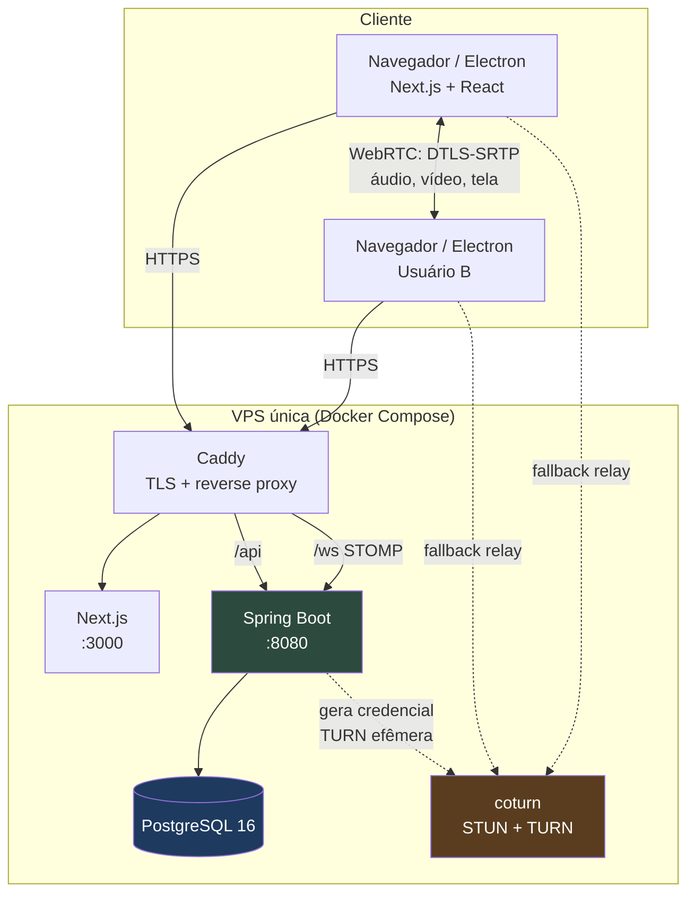
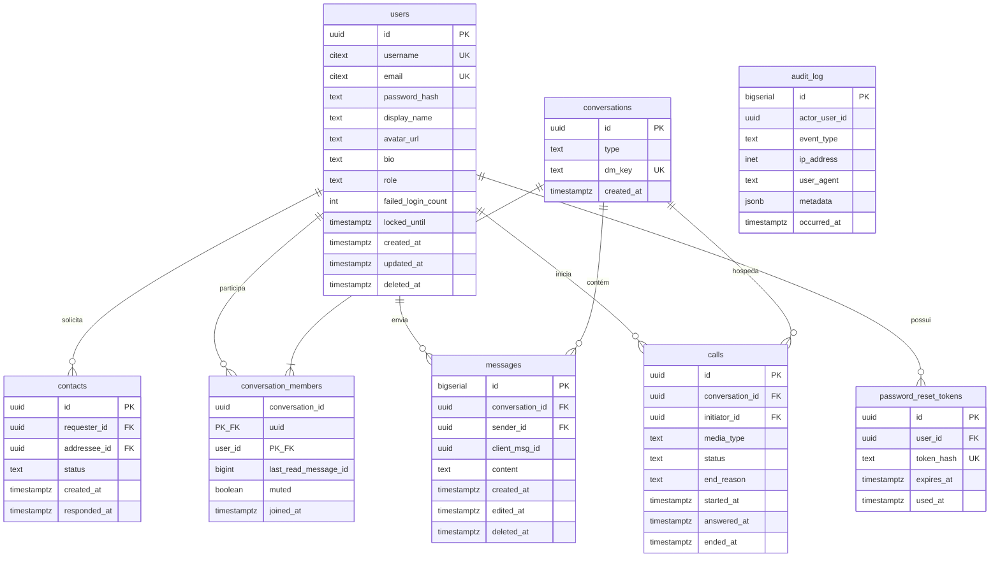
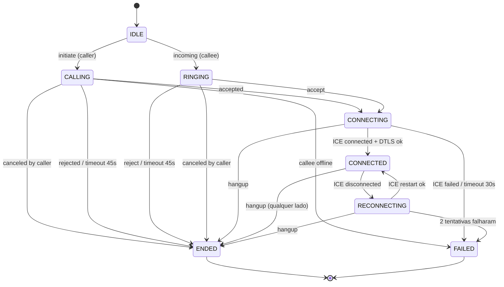

# Concord — Visão Geral e Arquitetura

**Documento 00 — Fundação técnica (pré-implementação)**
Versão 0.1 · Status: aguardando aprovação
Escopo: aplicativo de comunicação privado (chat, voz, vídeo, screen share) para poucos usuários.

---

## 1. Visão geral do sistema

Concord é um aplicativo de comunicação **privado e de pequeno porte**: um grupo fechado de usuários autorizados troca mensagens em tempo real e faz chamadas de voz/vídeo com compartilhamento de tela, primeiro pelo navegador e depois por um aplicativo desktop.

A premissa que rege todas as decisões abaixo:

> **10–50 usuários registrados, até ~10 conexões simultâneas, até ~3 chamadas 1:1 simultâneas.**

Isso não é um detalhe: é o que autoriza um monolito, um banco só, sem Redis, sem fila, sem SFU, sem cluster. Se essa premissa mudar (ex.: 500 usuários, salas com 8 pessoas), duas decisões precisam ser revistas — o broker STOMP em memória e o P2P puro. As duas estão isoladas justamente para isso.

**Modelo mental em uma frase:** o backend Java é o *plano de controle* (quem é você, com quem você pode falar, quem está online, quem tocou o telefone de quem, o que foi dito por escrito). O WebRTC é o *plano de dados* de mídia (áudio, vídeo, tela) e **não passa pelo backend** — exceto pelos bytes relayados pelo TURN quando o P2P direto falhar.

**Três componentes de runtime, um servidor:**

| Componente | Papel | Tecnologia |
|---|---|---|
| Frontend | UI, captura de mídia, RTCPeerConnection | Next.js 15 + TypeScript |
| Backend | Auth, REST, sinalização, presença, persistência | Spring Boot 3.5 + PostgreSQL |
| TURN | Relay de mídia quando NAT bloqueia P2P | coturn |

---

## 2. Requisitos funcionais (MVP)

Numerados para virarem critérios de teste depois.

**RF-01 Conta e sessão**
Cadastro aberto (username + e-mail + senha) **com verificação de e-mail obrigatória**, login, logout, alteração de senha, recuperação de senha por e-mail, encerramento de sessão em todos os dispositivos.
Estados da conta: `PENDING_VERIFICATION → ACTIVE → DISABLED | DELETED`. Conta não verificada não loga, não aparece em buscas e não recebe solicitação de contato.

**RF-02 Perfil**
Nome de exibição, avatar (opcional), status textual curto, edição do próprio perfil.

**RF-03 Descoberta e contatos**
Buscar usuário por username exato (não listagem aberta do diretório — ver §12), enviar solicitação de contato, aceitar/recusar, remover, bloquear. Só há conversa entre contatos aceitos.

**RF-04 Chat privado 1:1**
Enviar e receber mensagens de texto em tempo real; histórico paginado; timestamp; identificação do remetente; estado de envio (`sending → sent → delivered → read`); contador de não lidas; ordenação determinística; deduplicação; recuperação de mensagens perdidas após queda de conexão.

**RF-05 Presença**
Online / ausente / offline, derivado da conexão WebSocket (não persistido). Visível apenas para contatos aceitos.

**RF-06 Chamada 1:1**
Iniciar chamada de voz ou vídeo, tocar no destinatário, aceitar, recusar, cancelar, encerrar. Estado da chamada consistente nos dois lados. Registro de metadados (quem, quando, duração, motivo do fim) — **sem gravação de mídia**.

**RF-07 Controles de mídia**
Mute/unmute microfone, câmera on/off, seleção de câmera, de microfone e de saída de áudio, preview antes de entrar, volume do remoto, indicador de quem está falando (opcional na Fase 5).

**RF-08 Compartilhamento de tela**
Iniciar/parar; escolher tela inteira, janela ou aba (conforme o navegador); detectar o encerramento feito pela UI nativa do navegador; conviver com a câmera na mesma chamada (renegociação).

**RF-09 Notificações**
Notificação de nova mensagem e de chamada recebida quando a aba está em background (Notification API no web; notificação nativa no Electron). Som de toque.

**RF-10 Privacidade / LGPD**
Exportar meus dados (JSON), excluir minha conta, ver a política de privacidade, revogar sessões.

**Fora do MVP (explicitamente):** servidores/comunidades públicas, canais de voz persistentes, chamadas em grupo, gravação, anexos e upload de arquivos, bots, reações, threads, e2ee, federação, plugins.

> **Nota sobre anexos:** você não pediu upload de arquivos e eu não vou incluir. É a única funcionalidade "óbvia de chat" que estou deixando de fora, e de propósito: ela arrasta storage, antivírus, limites de tamanho, links assinados, retenção e um capítulo inteiro de LGPD. Melhor como Fase 11.

---

## 3. Requisitos não funcionais

| # | Requisito | Alvo concreto |
|---|---|---|
| RNF-01 | Custo de hospedagem | 1 VPS (2 vCPU / 4 GB / 80 GB) + domínio. TURN no mesmo host inicialmente. |
| RNF-02 | Latência de mensagem | < 300 ms fim a fim em rede normal |
| RNF-03 | Latência de mídia | Dependente do WebRTC; P2P direto em ≥ 80% dos casos, TURN como fallback |
| RNF-04 | Disponibilidade | "Melhor esforço". Sem HA, sem multi-AZ. Restart automático via Docker. RTO ~1h, RPO ~24h (ver §16) |
| RNF-05 | Segurança | HTTPS obrigatório, cookies HttpOnly/Secure/SameSite, senhas com Argon2id, sem segredo em código |
| RNF-06 | Privacidade | Mídia nunca gravada; mídia sempre cifrada (DTLS-SRTP, obrigatório no WebRTC) |
| RNF-07 | Manutenibilidade | Um dev consegue subir tudo com `docker compose up -d` e entender o backend em uma tarde |
| RNF-08 | Portabilidade desktop | Zero fork do frontend: o Electron carrega o mesmo build |
| RNF-09 | Observabilidade | Logs estruturados JSON, `/actuator/health`, métricas básicas. Sem Prometheus/Grafana no MVP |
| RNF-10 | Acessibilidade | Navegação por teclado nos fluxos principais, foco visível, labels e `aria-*`, contraste AA |
| RNF-11 | Compatibilidade | Chrome/Edge 120+, Firefox 120+ (com ressalvas em `setSinkId`), Electron 33+. Safari: melhor esforço |
| RNF-12 | Retenção de dados | Definida por tabela em §14, não "para sempre por padrão" |

---

## 4. Arquitetura recomendada

### 4.1 Estilo geral

**Monolito modular** no backend, **organizado por feature** (não por camada técnica global), com um frontend Next.js separado e um coturn separado. Três processos, um `docker-compose.yml`, um banco.

```
┌───────────────────────── VPS única ─────────────────────────┐
│                                                             │
│   Caddy (443/80) ── TLS automático, reverse proxy           │
│     │                                                       │
│     ├── /            → Next.js (Node, porta 3000)           │
│     ├── /api/*       → Spring Boot (porta 8080)             │
│     └── /ws          → Spring Boot (upgrade WebSocket)      │
│                                                             │
│   Spring Boot ──── PostgreSQL 16 (volume Docker)            │
│                                                             │
│   coturn (3478 UDP/TCP, 5349 TLS, relay 49160-49200/UDP)    │
│     └── network_mode: host  (obrigatório — ver §15)         │
└─────────────────────────────────────────────────────────────┘
```

**Frontend e backend no mesmo domínio** (`concord.exemplo.com` e `concord.exemplo.com/api`). Essa decisão é mais importante do que parece: elimina CORS complexo, permite cookie `SameSite=Lax` em vez de `None`, e evita a dança de refresh token cross-site. É o que torna a autenticação por sessão viável e simples.

### 4.2 ADR-01 — MVC em camadas vs Clean vs Hexagonal

**Problema:** que organização interna dar ao backend.

**Opções:** (a) MVC em camadas por feature; (b) Clean Architecture com use cases, ports e adapters; (c) Hexagonal completo com domínio isolado de frameworks.

**Escolha:** (a) **camadas simples (`controller → service → repository`), agrupadas por feature**, com DTOs na fronteira e entidades JPA nunca expostas.

**Justificativa:** Clean e Hexagonal pagam por si quando existe lógica de domínio complexa, múltiplos adaptadores de entrada/saída, ou necessidade real de trocar infraestrutura. Concord tem CRUD, uma máquina de estados de chamada e roteamento de eventos. Um use case por operação criaria ~40 classes de interface para nada. Entidades JPA como modelo de domínio é aceitável aqui; o custo aparece só quando o domínio fica rico.

**Impacto futuro:** se um módulo específico ficar complexo (o mais provável é `call`, com a máquina de estados), ele pode isolar seu domínio internamente sem contaminar o resto — é exatamente o que package-by-feature permite. A migração dolorosa (camadas globais → features) já está evitada desde o começo.

### 4.3 ADR-02 — Sessão em cookie vs JWT

**Problema:** como autenticar HTTP, WebSocket e, depois, o Electron.

**Opções:**
- (a) JWT access curto no `localStorage` + refresh token;
- (b) JWT access curto em cookie HttpOnly + refresh em cookie;
- (c) **sessão opaca server-side em cookie HttpOnly**, armazenada no PostgreSQL via Spring Session JDBC.

**Escolha:** (c) **sessão opaca em cookie**.

**Justificativa:**
1. **Revogação é requisito seu** (§7: "revogação de sessão"). Com sessão opaca, revogar é um `DELETE` numa linha, com efeito imediato. Com JWT, revogação exige blacklist — que é um session store com nome pior.
2. **`localStorage` é vulnerável a XSS.** Qualquer script injetado lê o token. Cookie `HttpOnly` não é legível por JS. Para um app que renderiza texto enviado por outro usuário, isso não é teórico.
3. **O handshake WebSocket carrega o cookie automaticamente.** Não preciso inventar autenticação no frame CONNECT nem passar token em query string (que vaza em logs de proxy).
4. **Escala não é problema:** o argumento pró-JWT é statelessness para N instâncias. Temos uma instância e um banco que já é consultado a cada request.
5. O Electron é Chromium: o cookie funciona igual, desde que o app carregue de uma origem HTTPS real (§17).

**Custo assumido:** um SELECT por request (irrelevante nesse volume) e necessidade de proteção CSRF (Spring Security resolve com token double-submit; `SameSite=Lax` já bloqueia a maior parte).

**Impacto futuro:** se um dia existir app móvel nativo ou API pública para terceiros, adiciona-se um fluxo de token *ao lado* da sessão — sem reescrever nada. O caminho inverso (JWT → sessão) é mais caro.

> Consequência para o `.env`: `JWT_SECRET` deixa de existir. As variáveis passam a ser `SESSION_COOKIE_NAME`, `SESSION_TIMEOUT` e o segredo fica no banco (a sessão é opaca, não assinada).

### 4.4 ADR-03 — REST vs GraphQL

**Escolha:** REST + JSON, com WebSocket para o que é push.

**Justificativa:** GraphQL resolve over-fetching em UIs com muitos consumidores e formatos variados. Concord tem uma UI e ~20 endpoints. GraphQL traria N+1, complexidade de autorização por campo e análise de profundidade de query como novo vetor de DoS. Não paga.

### 4.5 ADR-04 — STOMP vs WebSocket cru

**Problema:** protocolo de aplicação sobre o WebSocket.

**Opções:** (a) WebSocket cru com envelope JSON próprio; (b) STOMP com broker simples do Spring; (c) STOMP com broker externo (RabbitMQ).

**Escolha:** (b) **STOMP com `SimpleBroker` em memória**.

**Justificativa:** o Spring entrega pronto o que eu teria que escrever à mão em (a): roteamento por destino, `@MessageMapping`, e principalmente **destinos de usuário** (`/user/queue/...`), que resolvem "entregar este evento só para o usuário X, em todas as sessões dele". Sinalização WebRTC é exatamente isso. (c) só faz sentido com múltiplas instâncias.

**Impacto futuro:** o `SimpleBroker` **obriga instância única** — mensagens não cruzam JVMs. Se um dia houver duas instâncias, troca-se por um relay (RabbitMQ/ActiveMQ) mudando ~5 linhas de config, sem tocar nos handlers. Registro consciente dessa dívida.

### 4.6 ADR-05 — P2P vs SFU

**Escolha:** **P2P puro (mesh de 2 peers)** para chamadas 1:1.

**Justificativa:** com dois participantes, SFU só adiciona um servidor de mídia, custo de CPU/banda e ~2000 linhas de integração, para piorar a latência. P2P é a arquitetura correta para 1:1, ponto.

**Impacto futuro / caminho de evolução:** mesh degrada rápido — com N participantes cada cliente mantém N-1 PeerConnections e faz N-1 uploads do próprio vídeo. Aceitável até 3–4 pessoas; inviável em 5+. Se chamadas em grupo entrarem no escopo:
1. Introduzir uma SFU (**LiveKit** é a mais direta; mediasoup dá mais controle e mais trabalho);
2. O backend Java deixa de rotear SDP e passa a emitir *tokens de sala* para a SFU;
3. O frontend troca a implementação do `CallTransport` (ver §6) — a UI e a máquina de estados são preservadas.

Isolar a sinalização atrás de uma interface no frontend é o que torna essa troca barata. Vale a pena fazer desde a Fase 5.

### 4.7 ADR-06 — Electron vs Tauri

**Escolha:** **Electron**, confirmando sua preferência — mas por um motivo técnico específico, não por inércia.

**Justificativa:** o argumento normal pró-Tauri (binário de ~10 MB vs ~150 MB, menos RAM) é real, e em quase qualquer outro app eu recomendaria Tauri. Aqui ele perde por um detalhe decisivo: **Tauri usa a webview do sistema operacional**, e a stack WebRTC dessas webviews é heterogênea:

| Plataforma | Webview do Tauri | Risco para Concord |
|---|---|---|
| Windows | WebView2 (Chromium) | OK |
| macOS | WKWebView (WebKit) | `getDisplayMedia` e `setSinkId` com suporte irregular |
| Linux | WebKitGTK | Captura de tela depende de PipeWire/portal; historicamente frágil |

Além disso o Electron oferece `desktopCapturer` + `session.setDisplayMediaRequestHandler`, que é a forma suportada de construir um seletor de fonte de captura próprio no desktop (§17). Tauri não tem equivalente maduro.

**Conclusão:** para um app cujo núcleo é áudio/vídeo/tela, pagar 150 MB por uma engine Chromium única e previsível em três SOs é o trade-off certo. Se o app fosse só chat, eu diria Tauri.

**Impacto futuro:** Electron exige disciplina de segurança (`contextIsolation`, `sandbox`, sem `nodeIntegration`) e um ciclo de atualização atento a CVEs do Chromium. Isso está previsto na Fase 10.

### 4.8 ADR-07 — PostgreSQL

**Escolha:** PostgreSQL 16 + JPA/Hibernate + **Flyway** para migrations.

**Justificativa:** relacional é o modelo certo (usuários, contatos, conversas, mensagens são relações). SQLite não serve com múltiplos processos e concorrência de escrita; Mongo perderia integridade referencial sem ganho. Postgres ainda dá `jsonb` (metadados de auditoria), `citext` (username case-insensitive), índices parciais e `pg_dump` trivial.

**Sobre JPA:** sim, com uma regra — **nada de `spring.jpa.hibernate.ddl-auto` diferente de `validate`**. O schema é definido em SQL versionado no Flyway; o Hibernate só valida.

---

## 5. Diagrama da arquitetura



**Leitura do diagrama:** a linha grossa entre B e B2 é a mídia — ela **não toca** no Spring Boot. As linhas pontilhadas para o coturn só se ativam quando o ICE não consegue um caminho direto.

---

## 6. Estrutura de diretórios

```
concord/
├── docker-compose.yml
├── docker-compose.prod.yml
├── .env.example
├── Caddyfile
├── README.md
├── docs/
│   ├── ARCHITECTURE.md   SECURITY.md   DATABASE.md
│   ├── API.md            WEBSOCKET.md  WEBRTC.md
│   ├── DEPLOY.md         LGPD.md       DESKTOP.md
│   └── adr/  (0001-sessao-vs-jwt.md, ...)
│
├── backend/
│   ├── Dockerfile
│   ├── pom.xml
│   └── src/main/
│       ├── java/app/concord/
│       │   ├── ConcordApplication.java
│       │   ├── config/          SecurityConfig, WebSocketConfig,
│       │   │                    CorsConfig, RateLimitConfig, JacksonConfig
│       │   ├── common/
│       │   │   ├── exception/   ApiException, GlobalExceptionHandler, ErrorCode
│       │   │   ├── dto/         PageResponse, ErrorResponse
│       │   │   ├── audit/       AuditService, AuditEvent
│       │   │   └── ratelimit/   RateLimiter (Bucket4j)
│       │   ├── user/            controller, service, repository, User, dto/, mapper/
│       │   ├── auth/            AuthController, AuthService, PasswordResetService
│       │   ├── contact/         ContactController, ContactService, Contact
│       │   ├── conversation/    ConversationController, ConversationService
│       │   ├── message/         MessageController, MessageService, Message
│       │   ├── presence/        PresenceService (em memória), PresenceEventPublisher
│       │   ├── call/            CallController, CallService, CallStateMachine, Call
│       │   ├── signaling/       SignalingController (@MessageMapping), payloads/
│       │   ├── turn/            TurnCredentialService, TurnController
│       │   └── privacy/         DataExportService, AccountDeletionService
│       └── resources/
│           ├── application.yml  application-dev.yml  application-prod.yml
│           └── db/migration/    V1__init.sql, V2__...
│
├── frontend/
│   ├── Dockerfile
│   ├── next.config.ts
│   └── src/
│       ├── app/
│       │   ├── (auth)/login/page.tsx
│       │   ├── (auth)/register/page.tsx
│       │   ├── (auth)/reset-password/page.tsx
│       │   ├── (app)/layout.tsx
│       │   ├── (app)/chat/page.tsx
│       │   ├── (app)/chat/[conversationId]/page.tsx
│       │   ├── (app)/settings/page.tsx
│       │   └── layout.tsx
│       ├── features/
│       │   ├── auth/        components/ hooks/ api.ts
│       │   ├── contacts/    components/ hooks/ api.ts store.ts
│       │   ├── chat/        components/ hooks/ api.ts store.ts
│       │   ├── call/        components/ hooks/ store.ts
│       │   │                CallManager.ts, PeerConnectionController.ts,
│       │   │                callStateMachine.ts, SignalingTransport.ts
│       │   ├── devices/     useMediaDevices.ts, DeviceSelector.tsx
│       │   ├── presence/
│       │   └── settings/
│       ├── components/ui/   (shadcn/ui)
│       ├── lib/             apiClient.ts, stompClient.ts, config.ts,
│       │                    errors.ts, platform.ts (web vs electron)
│       ├── hooks/           useNotification.ts, useVisibility.ts
│       ├── stores/          sessionStore.ts, uiStore.ts
│       └── types/           api.ts, ws.ts, webrtc.ts
│
└── desktop/                 (Fase 10 — não criar antes)
    ├── package.json
    └── src/  main.ts, preload.ts, ipc/, windows/
```

**Regra estrutural do frontend, que é onde esses projetos costumam apodrecer:** `RTCPeerConnection` e `MediaStream` **nunca** entram em estado React. Eles vivem em `CallManager`, uma classe singleton fora do ciclo de render, que emite eventos para uma store Zustand. React lê a store e renderiza; `<video>` recebe o stream via `ref`. Sem isso, cada re-render arrisca recriar peer connections e vazar tracks.

---

## 7. Modelo inicial do banco

### 7.1 Diagrama ER



### 7.2 Decisões de modelagem que valem explicação

**`messages.id` é `BIGSERIAL`, não UUID.** Ordenação e paginação por cursor precisam de um valor monotônico. `ORDER BY id` dentro de uma conversa é estável, indexável e barato. UUIDv4 daria ordenação aleatória; UUIDv7 resolveria, mas `BIGSERIAL` é mais simples e o id não é secreto (o acesso é autorizado por membership, não por obscuridade do id).

**`messages.client_msg_id` + `UNIQUE (sender_id, client_msg_id)`** é o mecanismo de deduplicação: o cliente gera um UUID antes de enviar; se reenviar após timeout, o servidor detecta a violação de unicidade e devolve a mensagem já persistida em vez de duplicar. Resolve o item "tratamento de mensagens duplicadas" de forma determinística, sem heurística.

**`conversations.dm_key`** = `menor_uuid + ':' + maior_uuid`, com `UNIQUE`. Impede, no nível do banco, duas conversas diretas entre o mesmo par — uma race condition clássica quando os dois clicam ao mesmo tempo.

**Não existe tabela `message_reads`.** Em conversa 1:1, "até onde eu li" é um único ponteiro: `conversation_members.last_read_message_id`. Uma tabela por (mensagem × leitor) cresceria linearmente com o tráfego para representar a mesma informação. Se um dia houver grupos, o ponteiro por membro continua funcionando.

**Não existe tabela `call_participants`.** Em 1:1 os participantes são os membros da conversa; `initiator_id` diz quem ligou. A tabela entra junto com a SFU, se entrar.

**Presença não é persistida.** É estado volátil derivado das sessões WebSocket ativas — vive num `ConcurrentHashMap` no `PresenceService`. Escrever no banco a cada online/offline seria escrita constante para um dado que expira em segundos e que é perdido de qualquer forma num restart.

**Sessões:** tabelas `SPRING_SESSION` e `SPRING_SESSION_ATTRIBUTES`, criadas e gerenciadas pelo Spring Session JDBC (schema oficial, incluído numa migration).

### 7.3 Constraints e índices essenciais

```sql
-- contacts
CHECK (requester_id <> addressee_id)
CHECK (status IN ('PENDING','ACCEPTED','BLOCKED'))
UNIQUE (requester_id, addressee_id)
CREATE INDEX ON contacts (addressee_id, status);

-- messages
CHECK (char_length(content) BETWEEN 1 AND 4000)
UNIQUE (sender_id, client_msg_id)
CREATE INDEX ON messages (conversation_id, id DESC);   -- paginação por cursor
CREATE INDEX ON messages (id) WHERE deleted_at IS NULL;

-- conversation_members
PRIMARY KEY (conversation_id, user_id)
CREATE INDEX ON conversation_members (user_id);          -- "minhas conversas"

-- calls
CHECK (status IN ('RINGING','ACTIVE','ENDED','FAILED','REJECTED','MISSED','CANCELED'))
CREATE INDEX ON calls (conversation_id, started_at DESC);

-- password_reset_tokens
CREATE INDEX ON password_reset_tokens (expires_at);      -- limpeza
```

Todas as FKs com `ON DELETE` explícito: `CASCADE` em `conversation_members` e `password_reset_tokens`; `RESTRICT` em `messages.sender_id` (exclusão de conta é tratada por anonimização, não por delete em cascata — ver §14).

---

## 8. Arquitetura WebRTC

### 8.1 O que o WebRTC resolve e o que não resolve

O WebRTC entrega mídia cifrada entre dois navegadores. Ele **não** resolve: descobrir o outro peer, autenticar, transportar SDP/ICE, nem atravessar NAT sozinho. Essas quatro coisas são responsabilidade nossa.

- **Descoberta e transporte de sinalização:** nosso WebSocket/STOMP (§9).
- **NAT:** o ICE tenta, em ordem, candidatos `host` (rede local) → `srflx` (endereço público descoberto via **STUN**) → `relay` (**TURN**).

**Quando STUN basta:** a maioria dos NATs domésticos (cone NAT). O STUN só informa ao peer qual é seu IP:porta público; a mídia vai direta. Custo ~zero.

**Quando TURN é obrigatório:** NAT simétrico (comum em operadoras móveis e CGNAT), firewalls corporativos que bloqueiam UDP, redes que só liberam 443/TCP. Nesses casos o STUN falha e **sem TURN a chamada simplesmente não conecta**. Na prática, 10–20% das tentativas. Não é opcional — é a diferença entre "funciona sempre" e "funciona na casa do dev".

O TURN **relaya todos os bytes de mídia**, então consome banda do servidor: ~1,5 Mbps por direção numa chamada de vídeo 720p, ~3 Mbps por chamada relayada. É o item de custo variável do projeto, e o motivo do alerta em §18.

### 8.2 Credenciais TURN efêmeras (ponto de segurança)

Não colocar usuário/senha estáticos do TURN no frontend. Qualquer pessoa com DevTools teria um relay de banda grátis.

Usar o mecanismo **TURN REST API** do coturn:

- coturn roda com `use-auth-secret` e um `static-auth-secret` (variável de ambiente, só no servidor);
- o backend expõe `GET /api/turn/credentials` (autenticado) que devolve:
  - `username = <unix_timestamp_de_expiracao>:<user_id>`
  - `credential = base64(HMAC-SHA1(secret, username))`
  - TTL de ~600 s.

O frontend pede essas credenciais imediatamente antes de criar a `RTCPeerConnection`. Elas expiram sozinhas e são rastreáveis por usuário.

### 8.3 Fluxo completo de uma chamada

```mermaid
sequenceDiagram
    participant A as Usuário A
    participant S as Spring Boot (signaling)
    participant B as Usuário B
    participant T as coturn

    A->>S: POST /api/calls {conversationId, mediaType}
    S->>S: valida membership + estado do callee
    S-->>A: 201 {callId} + estado CALLING
    S->>B: /user/queue/call → CALL_INCOMING

    A->>S: GET /api/turn/credentials
    B->>S: GET /api/turn/credentials
    A->>A: getUserMedia() → preview local
    Note over B: toca; usuário aceita
    B->>S: SEND /app/call.accept {callId}
    S->>A: CALL_ACCEPTED

    A->>A: new RTCPeerConnection(iceServers)<br/>addTrack, createOffer
    A->>S: SEND /app/signal {callId, type:OFFER, sdp}
    S->>S: autoriza (A pertence à chamada?)
    S->>B: /user/queue/signal → OFFER
    B->>B: setRemoteDescription, getUserMedia,<br/>addTrack, createAnswer
    B->>S: SEND /app/signal {type:ANSWER, sdp}
    S->>A: ANSWER

    par Trickle ICE (bidirecional e contínuo)
        A->>S: ICE_CANDIDATE
        S->>B: ICE_CANDIDATE
        B->>S: ICE_CANDIDATE
        S->>A: ICE_CANDIDATE
    end

    A-->>B: conectividade direta (host/srflx)
    alt P2P direto falhou
        A->>T: aloca relay
        B->>T: aloca relay
        A-->>T: mídia
        T-->>B: mídia
    end

    Note over A,B: DTLS handshake → SRTP → CONNECTED
    A->>S: SEND /app/call.end
    S->>B: CALL_ENDED
    S->>S: persiste duração e end_reason
```

**O que passa pelo backend:** SDP (offer/answer), ICE candidates, eventos de estado da chamada, credenciais TURN. São kilobytes.
**O que nunca passa pelo backend:** áudio, vídeo, tela.

### 8.4 Casos que a implementação precisa cobrir explicitamente

| Situação | Tratamento |
|---|---|
| Permissão de mídia negada | `NotAllowedError` → UI explica e oferece continuar só com áudio ou cancelar |
| Dispositivo inexistente | `NotFoundError` → tenta fallback de constraints; se falhar, chamada só de áudio |
| Dispositivo em uso por outro app | `NotReadableError` → mensagem específica ("outro aplicativo está usando a câmera") |
| Troca de câmera/microfone em chamada | `getUserMedia` no novo device → `RTCRtpSender.replaceTrack()` — **não** renegocia, é instantâneo |
| Troca de saída de áudio | `HTMLMediaElement.setSinkId()` — indisponível em Safari; esconder o seletor por feature-detection |
| Início do screen share | `getDisplayMedia()` → `addTrack` ou `replaceTrack` no sender de vídeo, conforme decisão de layout |
| Usuário para o share pela UI do navegador | escutar `track.onended` do track de tela e reverter para a câmera |
| Perda de conectividade | `oniceconnectionstatechange` → `disconnected` inicia timer de 5 s; `failed` dispara **ICE restart** (`createOffer({iceRestart:true})`) |
| Reconexão impossível | após 2 tentativas → estado `FAILED`, notifica ambos, persiste `end_reason` |
| Glare (ambos ligam ao mesmo tempo) | regra determinística: vence o `userId` lexicograficamente menor; o outro recebe `CALL_CANCELED` |
| Aba fechada / navegador morto | desconexão do WebSocket → backend encerra chamadas ativas daquele usuário |
| Encerramento | parar **todos** os tracks (`track.stop()`), `pc.close()`, limpar `srcObject` dos `<video>` — sem isso a luz da câmera fica acesa |

---

## 9. Arquitetura WebSocket / sinalização

### 9.1 Conexão e autorização

- Endpoint: `wss://concord.exemplo.com/ws`, STOMP sobre WebSocket (SockJS **não** será usado — todos os alvos suportam WS nativo).
- Autenticação no handshake HTTP, via o mesmo cookie de sessão. Um `HandshakeInterceptor` rejeita conexão sem sessão válida; o `Principal` fica disponível em todos os handlers.
- Heartbeat STOMP 10 s / 10 s; reconexão exponencial no cliente (1 s → 30 s, com jitter).

### 9.2 Destinos

| Direção | Destino | Uso |
|---|---|---|
| cliente → servidor | `/app/message.send` | enviar mensagem |
| cliente → servidor | `/app/message.read` | marcar lido até id |
| cliente → servidor | `/app/typing` | digitando |
| cliente → servidor | `/app/call.accept` `.reject` `.end` `.cancel` | controle de chamada |
| cliente → servidor | `/app/signal` | OFFER / ANSWER / ICE_CANDIDATE / RENEGOTIATE |
| servidor → cliente | `/user/queue/messages` | nova mensagem, ack, leitura |
| servidor → cliente | `/user/queue/call` | eventos de chamada |
| servidor → cliente | `/user/queue/signal` | sinalização WebRTC |
| servidor → cliente | `/user/queue/presence` | presença de contatos |
| servidor → cliente | `/user/queue/errors` | erros de comandos |

**Tudo é `/user/queue/*`.** Nenhum tópico público (`/topic/*`) no MVP — isso remove por construção a possibilidade de um cliente se inscrever em um fluxo alheio.

### 9.3 Como impedir envio para conversa/chamada alheia

Esta é a pergunta mais importante da §16 do briefing, e a resposta tem três camadas:

1. **Não confiar no remetente declarado.** O `senderId` vem sempre do `Principal` da sessão STOMP, nunca do payload. Campos como `senderId`/`fromUserId` são ignorados se aparecerem.
2. **Verificar membership a cada mensagem, no servidor.** Antes de qualquer efeito: `conversationMemberRepository.existsByConversationIdAndUserId(convId, principalId)`. Para sinalização: `callService.isParticipant(callId, principalId)`. Falha → evento em `/user/queue/errors` + registro de auditoria, sem vazar se o recurso existe (mesma resposta para "não existe" e "não é seu").
3. **Não rotear por destino fornecido pelo cliente.** O cliente publica em `/app/...` e o *servidor* decide para quem entregar, resolvendo o destinatário a partir do banco. O cliente nunca diz "entregue para o usuário X".

Camada extra: rate limit por sessão (ex.: 30 mensagens / 10 s, 100 candidates ICE / chamada) para conter abuso e loops de reconexão.

### 9.4 Garantia de entrega de mensagens

O requisito "não perder mensagens numa desconexão momentânea" exige uma peça além do WebSocket, porque WebSocket não garante entrega:

- Toda mensagem tem `id` monotônico global.
- O cliente guarda o maior `id` recebido por conversa.
- Na reconexão, o cliente chama `GET /api/messages/sync?since={lastId}` e recebe tudo que perdeu, em todas as conversas.
- Envio: o cliente marca `sending` com `client_msg_id`, e só confirma ao receber o ack com o `id` do servidor. Retransmissão após timeout é idempotente pela constraint única.

Ou seja: **o WebSocket é o caminho rápido; o REST é o caminho de verdade.** Essa é a razão de a sincronização ser HTTP e não WS.

---

## 10. Máquina de estados da chamada

Estados idênticos no cliente e no servidor; o servidor é a autoridade em caso de divergência.



**Invariantes obrigatórias:**
- um usuário tem no máximo **uma** chamada não terminal por vez (garantido no serviço, não só na UI);
- transições são aplicadas por uma função pura `transition(state, event) → state | Error`, testável sem rede — os testes da Fase 8 batem direto nela;
- toda saída para `ENDED`/`FAILED` **precisa** liberar recursos (tracks, PC, timers) e persistir `end_reason`;
- eventos fora de ordem que não formam transição válida são descartados com log, nunca aplicados.

---

## 11. Estratégia de autenticação

| Aspecto | Decisão |
|---|---|
| Sessão | Opaca, em cookie `concord_session`, armazenada em PostgreSQL (Spring Session JDBC) |
| Atributos do cookie | `HttpOnly`, `Secure`, `SameSite=Lax`, `Path=/` |
| Expiração | Inatividade de 7 dias; máximo absoluto de 30 dias |
| Hash de senha | **Argon2id** (`Argon2PasswordEncoder`, 19 MiB / 2 iterações / paralelismo 1) via `DelegatingPasswordEncoder` para permitir rotação futura |
| Política de senha | mínimo 12 caracteres; verificação contra lista de senhas comuns; sem exigência de caractere especial (segue NIST 800-63B) |
| Brute force | backoff progressivo por conta + `locked_until`; rate limit por IP; resposta genérica "credenciais inválidas" (sem revelar se o usuário existe) |
| Recuperação de senha | token aleatório de 256 bits enviado por e-mail; **apenas o hash é armazenado**; TTL 30 min; uso único; resposta sempre 202 (não revela se o e-mail existe); ao usar, **invalida todas as sessões** |
| Alteração de senha | exige senha atual; invalida as demais sessões, mantém a atual |
| Revogação | tela "sessões ativas" com nome do dispositivo, IP, último acesso, e botão de encerrar (individual ou todas) |
| CSRF | token do Spring Security em cookie legível + header `X-XSRF-TOKEN` nos métodos mutáveis |
| Cadastro | **Aberto** (decisão D-03), com verificação de e-mail obrigatória, rate limit de 3/hora por IP e 5/dia por faixa /24, campo honeypot e flag `REGISTRATION_OPEN` para fechar sem redeploy. Conta não verificada em 7 dias é excluída por job |
| Verificação de e-mail | Token de 256 bits, **armazenado como hash**, TTL 24 h, uso único. Reenvio limitado a 1 a cada 5 min. Reaproveita a tabela `password_reset_tokens`, generalizada para `user_tokens (type)` |

---

## 12. Estratégia de segurança

### Mapeamento OWASP Top 10 → controle concreto

| Risco | Controle no Concord |
|---|---|
| A01 Broken Access Control (IDOR/BOLA) | Toda query filtrada pelo usuário autenticado (`WHERE conversation_id = ? AND user_id = :principal`). Autorização em service, nunca só em controller. 404 genérico em vez de 403 para não confirmar existência. Teste automatizado dedicado: "usuário C tenta ler conversa de A e B" |
| A02 Cryptographic Failures | HTTPS obrigatório com HSTS; Argon2id; tokens de reset armazenados como hash; DTLS-SRTP na mídia (nativo do WebRTC) |
| A03 Injection | JPA parametrizado; **zero** concatenação de SQL; validação com Bean Validation; XSS mitigado pelo escape do React + CSP + **proibição de `dangerouslySetInnerHTML`** |
| A04 Insecure Design | Rate limit por endpoint; máquina de estados que rejeita transições inválidas; sem tópicos WS públicos |
| A05 Security Misconfiguration | Headers via Caddy (`CSP`, `X-Content-Type-Options`, `Referrer-Policy`, `Permissions-Policy`); Actuator restrito a `health` e `info`; stack trace nunca vaza (§ tratamento de erros); Postgres sem porta publicada no host |
| A06 Componentes vulneráveis | Dependabot + `mvn dependency-check` + `npm audit` no CI |
| A07 Auth Failures | Ver §11 |
| A08 Integrity Failures | Lockfiles commitados; imagens Docker com tag fixa (não `latest`); Electron sem carregar código remoto |
| A09 Logging Failures | `audit_log` para login, falha de login, troca de senha, criação/remoção de contato, exclusão de conta, acesso negado. **Nunca logar** conteúdo de mensagem, senha ou cookie |
| A10 SSRF | Nenhum endpoint aceita URL do usuário no MVP (motivo adicional para adiar avatar por URL: só upload, ou iniciais geradas) |

### 12.1 Contenção de abuso do cadastro aberto

Como o cadastro é público (D-03), o registro passa a ser a superfície mais exposta do sistema. Controles obrigatórios, todos na Fase 2:

| Controle | Parâmetro |
|---|---|
| Verificação de e-mail | Obrigatória antes do primeiro login; conta em `PENDING_VERIFICATION` é invisível na busca |
| Rate limit por IP | 3 registros/hora, 5/dia por faixa /24 |
| Honeypot | Campo oculto no formulário; preenchido → 201 falso, nada persistido |
| Timing constante | Registro e login respondem em tempo semelhante para e-mail existente e inexistente |
| Bloqueio de domínios descartáveis | Lista local de domínios temporários, atualizável, sem serviço externo |
| Expurgo | Job diário apaga contas não verificadas com mais de 7 dias |
| Interruptor | `REGISTRATION_OPEN=false` fecha o cadastro imediatamente |
| Busca de usuário | Apenas por **username exato**; 20 buscas/minuto por sessão; resposta idêntica para "não existe", "não verificado" e "bloqueou você" |

**Sem CAPTCHA de terceiros no MVP.** reCAPTCHA/hCaptcha resolveriam bots com mais eficácia, mas introduzem transferência internacional de dados pessoais e um script de terceiros que fura a CSP — dois problemas de LGPD por um problema de segurança. Se o volume de abuso justificar depois, a alternativa preferível é um proof-of-work no cliente (Altcha, self-hosted), que não envia dado nenhum para fora.

### Específicos deste projeto

- **CORS:** com frontend e backend no mesmo domínio, a política é restritiva por padrão; em dev, origem única `http://localhost:3000` com `allowCredentials=true` (nunca `*` junto de credenciais).
- **CSP:** `default-src 'self'; script-src 'self'; connect-src 'self' wss://concord.exemplo.com; media-src 'self' blob:; img-src 'self' data: blob:; frame-ancestors 'none'`. Next.js exigirá nonce para scripts inline — configurar no middleware.
- **Abuso de WebRTC:** o backend controla quem pode ligar para quem (só contatos aceitos); credenciais TURN efêmeras e vinculadas ao usuário; limite de chamadas simultâneas por usuário; log de alocações TURN.
- **Abuso de WebSocket:** limite de conexões por usuário (ex.: 5), limite de tamanho de frame (64 KB), rate limit por sessão, timeout de sessões ociosas.
- **Segredos:** exclusivamente por variáveis de ambiente / arquivo `.env` fora do git (com `.gitignore` desde o commit inicial). `.env.example` com placeholders. Nada de segredo em `application.yml`.

---

## 13. Estratégia LGPD

> **Aviso necessário:** o que segue é engenharia de privacidade, não parecer jurídico. Enquadramento de base legal, texto final da política de privacidade, necessidade de nomear encarregado (DPO), obrigações de relatório de impacto (RIPD) e conduta em caso de incidente **precisam de validação por advogado**. A aplicação implementa controles técnicos; ela não produz conformidade jurídica por si só. Ver §13.4.

### 13.1 Inventário de dados pessoais

| Dado | Finalidade | Base legal (proposta, a validar) | Retenção |
|---|---|---|---|
| Username | Identificação e busca entre usuários | Execução de contrato (art. 7º, V) | Enquanto a conta existir |
| E-mail | Login, recuperação de senha, avisos de segurança | Execução de contrato | Enquanto a conta existir |
| Hash da senha | Autenticação | Execução de contrato | Enquanto a conta existir |
| Nome de exibição, avatar, bio | Identificação social | Execução de contrato | Enquanto a conta existir |
| Conteúdo das mensagens | Prestação do serviço | Execução de contrato | Indefinido até exclusão pelo titular (ver 13.3) |
| Metadados de mensagem | Ordenação, leitura, entrega | Execução de contrato | Igual à mensagem |
| Lista de contatos | Funcionalidade central | Execução de contrato | Enquanto a conta existir |
| Metadados de chamada (quem, quando, duração) | Histórico e diagnóstico | Legítimo interesse (art. 7º, IX) | **90 dias**, depois expurgo automático |
| IP e user-agent no `audit_log` | Segurança, detecção de abuso | Legítimo interesse | **6 meses** |
| IP em logs de acesso do proxy | Segurança e operação | Legítimo interesse / art. 15 MCI | **6 meses** |
| Sessões ativas | Autenticação | Execução de contrato | Até expirar/revogar |
| **Áudio, vídeo, tela** | — | **Não coletado. Não gravado. Não armazenado.** | — |

Esse último item é a decisão de privacidade mais forte do projeto e precisa estar escrita na política: a mídia trafega cifrada ponta a ponta entre os pares (ou relayada em bytes cifrados pelo TURN, sem chave para decifrar) e **em nenhum momento é persistida**.

### 13.2 Minimização aplicada

- Não coletar telefone, CPF, data de nascimento, endereço ou geolocalização — nada disso é necessário para o serviço.
- Não integrar analytics de terceiros (Google Analytics etc.), o que evita transferência internacional e cookies de terceiros por completo.
- Busca de usuário **por username exato**, não listagem aberta do diretório: reduz a exposição da base a qualquer usuário logado.
- Logs sem conteúdo de mensagem; e-mails mascarados nos logs (`j***@dominio.com`).

### 13.3 Direitos do titular → implementação

| Direito (art. 18) | Implementação |
|---|---|
| Acesso e portabilidade | `GET /api/privacy/export` → JSON com perfil, contatos, mensagens enviadas, metadados de chamadas. Rate limit de 1/dia |
| Correção | Edição de perfil na UI |
| Eliminação | `DELETE /api/privacy/account` com reautenticação por senha + confirmação. Ver abaixo |
| Informação sobre compartilhamento | Política de privacidade: sem compartilhamento com terceiros; subprocessadores listados (provedor de VPS, provedor de e-mail transacional) |
| Revogação de consentimento | Aplicável apenas ao que for baseado em consentimento (notificações opcionais) |

**Exclusão de conta — o ponto que exige decisão sua (D-05).** Mensagens são um dado com dois titulares: quem escreveu e quem recebeu. Apagar tudo destrói o histórico legítimo do outro; manter tudo com o nome do autor contraria a eliminação. Três opções:

- **(a) Anonimização** — a conta vira `usuario_removido_<hash>`, e-mail/senha/avatar/bio são apagados, `deleted_at` preenchido, mensagens permanecem com o autor anonimizado. Preserva o histórico do interlocutor. É a prática do WhatsApp/Signal e a minha recomendação.
- **(b) Exclusão total** — apaga também as mensagens enviadas, deixando lacunas nas conversas do outro usuário.
- **(c) Escolha do titular** no momento da exclusão, com explicação clara.

Em qualquer opção: sessões revogadas imediatamente, tokens de reset apagados, `audit_log` mantém apenas registros de segurança pelo prazo legal (com `actor_user_id` preservado ou pseudonimizado — item para o advogado).

### 13.4 O que depende de análise jurídica profissional

1. Base legal definitiva de cada tratamento (minha proposta acima é razoável, mas é proposta).
2. Se legítimo interesse se sustenta para logs de segurança e por quanto tempo — idealmente com um teste de balanceamento documentado.
3. Necessidade de encarregado (art. 41) para operação privada e pequena.
4. Texto final da política de privacidade e dos termos de uso.
5. Prazos de retenção frente ao Marco Civil da Internet (art. 15) — pode haver obrigação legal de guardar registros de acesso por 6 meses, o que *compete* com o desejo de reter menos.
6. Procedimento de resposta a incidente (art. 48) e prazo de comunicação à ANPD.
7. Se o serviço, mesmo privado, se enquadra como aplicação de internet para fins do MCI.

---

## 14. Privacidade operacional

| Pergunta | Resposta |
|---|---|
| O que fica armazenado? | Somente o listado em 13.1. Texto, metadados e credenciais. |
| Por quanto tempo? | Ver coluna de retenção. Jobs agendados (`@Scheduled`) executam o expurgo de chamadas > 90 dias e auditoria > 6 meses. |
| Quem pode acessar? | O próprio titular via aplicação; o interlocutor, quanto às mensagens trocadas; o administrador do servidor tem acesso técnico ao banco (fato que a política precisa declarar honestamente). Não há painel administrativo com leitura de mensagens alheias — e não deve haver. |
| Como excluir? | Autosserviço (§13.3). |
| Backup contém dados pessoais? | Sim. Backups são cifrados em repouso, retidos por 30 dias e restaurados apenas em recuperação de desastre. Exclusões propagam-se naturalmente ao expirar o backup — isso precisa constar na política. |
| Mídia é gravada? | Não. Em nenhuma circunstância no MVP. Se gravação for implementada no futuro, exige consentimento explícito e indicador visível para todos os participantes. |

---

## 15. Estratégia de deploy e infraestrutura

### 15.1 Composição

```yaml
services:
  caddy:      # 80, 443 — TLS automático via Let's Encrypt
  frontend:   # Next.js standalone, interno
  backend:    # Spring Boot, interno
  postgres:   # SEM ports: publicado — só rede interna
  coturn:     # network_mode: host
```

**Por que o coturn usa `network_mode: host`:** ele aloca portas de relay dinamicamente numa faixa ampla (ex.: 49160–49200/UDP). Mapear centenas de portas UDP em bridge NAT do Docker é lento e propenso a falha, e o coturn precisa enxergar o IP público real para anunciar candidatos corretos. Rede host é a configuração suportada. Consequência: o firewall precisa liberar essa faixa explicitamente.

Portas no firewall (UFW): 22 (restrito), 80, 443 (TCP), 3478 (UDP+TCP), 5349 (TCP/TLS), 49160–49200 (UDP).

### 15.2 Variáveis de ambiente (`.env.example`)

```
# --- Banco ---
POSTGRES_DB=concord
POSTGRES_USER=concord
POSTGRES_PASSWORD=
DATABASE_URL=jdbc:postgresql://postgres:5432/concord

# --- Sessão / segurança ---
SESSION_COOKIE_NAME=concord_session
SESSION_TIMEOUT=7d
CORS_ALLOWED_ORIGINS=https://concord.exemplo.com

# --- Cadastro ---
REGISTRATION_OPEN=true
EMAIL_VERIFICATION_TTL=24h
REGISTRATION_RATE_LIMIT_PER_IP_HOUR=3

# --- TURN ---
TURN_REALM=concord.exemplo.com
TURN_STATIC_AUTH_SECRET=
TURN_PUBLIC_IP=
NEXT_PUBLIC_STUN_URL=stun:concord.exemplo.com:3478
NEXT_PUBLIC_TURN_URL=turns:concord.exemplo.com:5349?transport=tcp

# --- E-mail (recuperação de senha) ---
SMTP_HOST=
SMTP_PORT=587
SMTP_USERNAME=
SMTP_PASSWORD=
MAIL_FROM=nao-responda@concord.exemplo.com

# --- Frontend ---
NEXT_PUBLIC_API_URL=https://concord.exemplo.com/api
NEXT_PUBLIC_WS_URL=wss://concord.exemplo.com/ws
```

Repare que `JWT_SECRET` não existe mais — consequência do ADR-02.

### 15.3 Sequência de deploy (resumo; detalhamento em `DEPLOY.md` na Fase 9)

VPS nova → usuário não-root + chave SSH + UFW + fail2ban → Docker e Compose → DNS A record → clonar repo → preencher `.env` → `docker compose -f docker-compose.prod.yml up -d` → Caddy emite certificado → Flyway aplica migrations no boot → verificar `/api/actuator/health` → criar primeiro usuário → **testar chamada entre duas redes diferentes** (uma delas em 4G, para exercitar o TURN de verdade).

### 15.4 Backup e restauração

- `pg_dump -Fc` diário via cron no host, cifrado com `age` ou `gpg`, retenção 30 dias, cópia **fora do servidor** (backup no mesmo disco não é backup).
- Migrations e `.env` (cifrado) também versionados/guardados — o dump sozinho não reconstrói o sistema.
- **Teste de restauração mensal, obrigatório:** subir um container Postgres limpo, `pg_restore` do dump mais recente, rodar uma checagem automatizada (contagem de usuários, contagem de mensagens, integridade de FKs, login de um usuário de teste). Um backup nunca restaurado deve ser tratado como inexistente — é exatamente o ponto que você levantou na §30.

---

## 16. Estratégia desktop

**Princípio:** o Electron é uma casca. Ele **não** recebe cópia do frontend nem lógica de negócio.

```
Next.js (mesmo código)
   ↓ build
Web App servida por HTTPS
   ↓ carregada por
BrowserWindow do Electron
   ↓ empacotada por electron-builder
Concord Desktop (.exe / .dmg / .AppImage)
```

**Decisão de carregamento:** a janela aponta para a **URL de produção HTTPS**, não para arquivos locais via `file://`. Motivo: preserva a origem, os cookies de sessão e o contexto seguro exigido por `getUserMedia`. Custo: exige conexão. Alternativa (empacotar o build estático) quebra o modelo de cookie/origem e traz complicações de CSP — não recomendo.

**Configuração de segurança inegociável:**

```ts
webPreferences: {
  contextIsolation: true,     // sempre
  nodeIntegration: false,     // sempre
  sandbox: true,
  webSecurity: true,
  preload: path.join(__dirname, 'preload.js')
}
```

O `preload` expõe via `contextBridge` uma superfície **mínima e nomeada** — `concord.getScreenSources()`, `concord.notify()`, `concord.setBadge()`, `concord.onDeepLink()` — nunca `ipcRenderer` cru, nunca `require`. Cada handler IPC valida o payload com um schema, exatamente como um endpoint HTTP.

**Ganhos reais do desktop:** notificações nativas mesmo com a janela fechada; badge no ícone; iniciar com o SO; seletor de fonte de captura próprio (via `desktopCapturer` + `setDisplayMediaRequestHandler`, com preview das telas/janelas — algo que o navegador não permite customizar); atalhos globais para mute.

**Diferença de screen share entre web e Electron:**

| | Navegador | Electron |
|---|---|---|
| Seletor de fonte | Nativo do browser, não customizável | Próprio, com miniaturas, via `desktopCapturer` |
| Áudio do sistema | Chrome: só aba/tela no Windows; Firefox: não | Mais controle, ainda dependente do SO |
| macOS | Pede permissão de gravação de tela ao SO | Idem + a permissão precisa ser concedida ao app assinado |
| Detecção de parada | `track.onended` | Igual |

**Endurecimento adicional:** bloquear `window.open` e navegação para fora do domínio (`setWindowOpenHandler` → `shell.openExternal`), `will-navigate` restrito à origem, CSP aplicada também no shell, e assinatura de código (Authenticode no Windows, notarização na Apple) antes de qualquer distribuição. Atualização via `electron-updater` com feed assinado.

---

## 17. Dependências recomendadas

**Backend (Maven, Spring Boot 3.5.x, Java 21 LTS)**

| Dependência | Motivo |
|---|---|
| `spring-boot-starter-web` | REST |
| `spring-boot-starter-websocket` | STOMP |
| `spring-boot-starter-security` | Auth, CSRF, headers |
| `spring-boot-starter-data-jpa` | Persistência |
| `spring-boot-starter-validation` | Bean Validation |
| `spring-boot-starter-mail` | Recuperação de senha |
| `spring-boot-starter-actuator` | Health e métricas |
| `spring-session-jdbc` | Sessão no Postgres |
| `org.postgresql:postgresql` | Driver |
| `org.flywaydb:flyway-core` + `flyway-database-postgresql` | Migrations |
| `org.bouncycastle:bcprov-jdk18on` | Argon2id |
| `com.bucket4j:bucket4j-core` | Rate limiting em memória |
| `org.mapstruct:mapstruct` | Entity ↔ DTO sem boilerplate |
| `net.logstash.logback:logstash-logback-encoder` | Log JSON estruturado |
| Testes | `spring-boot-starter-test`, `spring-security-test`, `testcontainers` (Postgres real nos testes de integração) |

**Não incluir:** Lombok (Java 21 tem records; Lombok complica processadores de anotação com MapStruct), Redis, Kafka, MapStruct+Lombok juntos, ModelMapper.

**Frontend (Next.js 15, React 19, TypeScript 5.6)**

| Dependência | Motivo |
|---|---|
| `@stomp/stompjs` | Cliente STOMP com reconexão |
| `zustand` | Estado de UI/chamada — leve, funciona fora do React (essencial para o `CallManager`) |
| `@tanstack/react-query` | Estado de servidor, cache, paginação infinita do histórico |
| `zod` | Validação de payloads de entrada (REST e WS) no cliente |
| `tailwindcss` + `shadcn/ui` | UI acessível baseada em Radix (foco, ARIA e teclado já corretos — atende §28) |
| `lucide-react` | Ícones |
| `date-fns` | Timestamps com locale pt-BR |
| Testes | `vitest`, `@testing-library/react`, `playwright` (fluxos e-2-e, inclusive com dois contextos de browser para testar chamada) |

**Não incluir:** Redux, socket.io (incompatível com STOMP/Spring), adapter.js (obsoleto para navegadores atuais), simple-peer (esconde justamente o que você quer controlar), Axios (fetch nativo basta).

**Desktop (Fase 10):** `electron`, `electron-builder`, `electron-updater`. Só isso.

---

## 18. Riscos técnicos

| # | Risco | Probabilidade | Impacto | Mitigação |
|---|---|---|---|---|
| R-01 | **Banda do TURN** estoura a franquia da VPS | Média | Alto (custo/corte) | Monitorar tráfego; limitar bitrate de vídeo (`setParameters`, ~1 Mbps); alertar em 70% da franquia; VPS com franquia generosa (Hetzner/Contabo) |
| R-02 | Chamada não conecta em rede corporativa/CGNAT | Alta | Alto | TURN sobre **TLS na 443** além da 3478; testar em 4G e em rede corporativa desde a Fase 5 |
| R-03 | Vazamento de recursos de mídia (câmera acesa após a chamada) | Alta | Médio | Função única de teardown; teste manual em checklist; `useEffect` cleanup rigoroso |
| R-04 | Divergência de estado entre os dois clientes | Média | Alto | Servidor como autoridade; máquina de estados pura testada; timeouts em todos os estados transitórios |
| R-05 | `SimpleBroker` em memória impede segunda instância | Baixa (no escopo atual) | Médio | Dívida registrada; caminho de migração para relay documentado (ADR-04) |
| R-06 | Diferenças entre navegadores (`setSinkId`, áudio de tela) | Alta | Baixo/Médio | Feature detection e degradação graciosa; matriz de compatibilidade documentada |
| R-07 | Bases legais LGPD incorretas | Média | Alto (jurídico) | Revisão por advogado antes de uso real com terceiros; §13.4 |
| R-08 | Complexidade do WebRTC atrasar o cronograma | Alta | Médio | Fase 5 dividida: primeiro **só áudio**, depois vídeo, depois tela |
| R-09 | Ponto único de falha (uma VPS) | Certa | Médio | Aceito conscientemente; mitigado por backup off-site testado |
| R-10 | E-mail de reset cair em spam | Média | Médio | Provedor transacional (Resend/Postmark/SES) com SPF, DKIM e DMARC — não `sendmail` no host |
| R-11 | Renegociação de screen share quebrar a chamada | Média | Médio | Preferir `replaceTrack` a renegociação sempre que possível; tratar `negotiationneeded` com fila e guarda contra glare |

---

## 19. Decisões que precisam da sua aprovação

| # | Decisão | Minha recomendação |
|---|---|---|
| **D-01** | Sessão em cookie **ou** JWT | ✅ **DECIDIDO: sessão em cookie** (ADR-02). `JWT_SECRET` não existe no `.env`. |
| **D-02** | Electron **ou** Tauri | ✅ **DECIDIDO: Electron** (ADR-06), pelo suporte a captura de tela. |
| **D-03** | Cadastro aberto, por convite ou criado por admin | ✅ **DECIDIDO: aberto**, contra minha recomendação inicial. Aceito com o pacote de contenção de §11 e §12.1 (verificação de e-mail, rate limit, honeypot, flag de desligamento). Consequência: **D-04 deixa de ser opcional**. |
| **D-04** | Existe papel de **administrador**? | ⚠️ **Agora obrigatório** por causa de D-03. Escopo mínimo: desativar/reativar conta, ver `audit_log`, alternar `REGISTRATION_OPEN`, forçar logout de um usuário. **Nunca** ler mensagens alheias — não existe endpoint para isso. |
| **D-05** | Exclusão de conta: anonimizar, apagar tudo, ou deixar o titular escolher | **Anonimizar** (§13.3), preservando o histórico do interlocutor. |
| **D-06** | Screen share substitui o vídeo da câmera ou vai como segundo stream | **Substituir via `replaceTrack`** no MVP. Segundo stream é mais bonito e bem mais complexo. |
| **D-07** | E-mail transacional: qual provedor | ⚠️ **Virou bloqueante da Fase 2**: com cadastro aberto, o e-mail deixa de servir só para reset de senha e passa a ser o portão de entrada. Resend (mais simples) ou Amazon SES (mais barato em volume). Exige SPF, DKIM e DMARC no domínio. |
| **D-08** | Domínio e provedor da VPS | Necessário antes da Fase 9; o TURN precisa de IP público estável e de um subdomínio para o certificado TLS. |
| **D-09** | Idioma da interface: só pt-BR ou preparar i18n | **Só pt-BR** no MVP; estrutura de strings centralizada para facilitar depois. |

---

## 20. Roadmap do MVP

Cada fase tem critério de conclusão verificável. Nenhuma fase começa antes de a anterior fechar.

| Fase | Escopo | Entregáveis principais | Critério de conclusão |
|---|---|---|---|
| **1. Fundação** | Monorepo, Docker Compose (postgres + backend + frontend), Caddy local, `.env.example`, lint/format, CI básico | `docker-compose.yml`, `pom.xml`, `next.config.ts`, `README.md` | `docker compose up -d` sobe os 3 serviços; `/api/actuator/health` responde `UP`; frontend abre |
| **2. Banco + Auth** | Migrations V1, entidades, Spring Security, sessão JDBC, **cadastro aberto com verificação de e-mail**, login/logout, reset de senha, rate limit, papel de admin mínimo | `V1__init.sql`, módulos `user/`, `auth/`, `admin/`, telas de login/cadastro/verificação | Cadastro exige verificação antes do primeiro login; cookie correto; senha em Argon2id; teste de brute force e de flood de registro passam; sessão revogável; admin desativa conta |
| **3. Contatos + Chat (REST)** | Busca por username, solicitações, conversas, envio e histórico paginado — **sem tempo real ainda** | módulos `contact/`, `conversation/`, `message/`; UI de 3 colunas | Dois usuários trocam mensagens com refresh manual; teste de IDOR passa (usuário C não lê conversa de A e B) |
| **4. WebSocket** | STOMP, auth no handshake, entrega em tempo real, presença, digitando, ack, sync por `since`, reconexão | `config/WebSocketConfig`, `presence/`, `lib/stompClient.ts` | Mensagem aparece em < 300 ms; matar a rede por 30 s e reconectar **não perde nem duplica** nenhuma mensagem |
| **5. WebRTC voz → vídeo** | coturn no compose, credenciais efêmeras, sinalização, máquina de estados, controles de mídia, seleção de dispositivos | `signaling/`, `call/`, `turn/`, `features/call/*` | Chamada de áudio entre duas redes diferentes (uma em 4G); depois vídeo; estados consistentes; encerramento libera câmera |
| **6. Screen share** | `getDisplayMedia`, `replaceTrack`, detecção de parada, UI da chamada | `ScreenShareButton`, ajustes no `CallManager` | Compartilhar e parar funciona em Chrome e Firefox; parar pela UI do navegador reverte para a câmera |
| **7. Segurança + LGPD** | Headers, CSP, CSRF, auditoria, exportação, exclusão de conta, jobs de retenção, política de privacidade | `privacy/`, `common/audit/`, `docs/SECURITY.md`, `docs/LGPD.md` | Exportação devolve JSON completo; exclusão anonimiza e revoga sessões; jobs de expurgo testados |
| **8. Testes** | Unitários, integração com Testcontainers, e-2-e Playwright (dois contextos), testes de autorização | `src/test/**`, `e2e/**` | Cobertura útil nos fluxos críticos; suíte roda no CI; testes de acesso indevido passam |
| **9. Deploy** | VPS, TLS, firewall, backup + **teste de restauração**, logs, health | `docker-compose.prod.yml`, `DEPLOY.md`, scripts de backup | Sistema no ar em domínio real; chamada entre duas redes externas; restauração de backup validada |
| **10. Desktop** | Electron shell, preload, IPC, seletor de captura, notificações, updater, assinatura | `desktop/**`, `docs/DESKTOP.md` | Instalador funcional em ao menos um SO; chamada e screen share funcionam no app; auditoria de segurança do Electron concluída |

**Ordem deliberada:** chat por REST **antes** do WebSocket (Fase 3 antes da 4) para que o modelo de dados e a autorização estejam corretos antes de adicionar a complexidade do tempo real. E segurança/LGPD numa fase própria só porque precisam de foco — os controles básicos (autorização, validação, headers) entram desde a Fase 2, não são adiados.

---

## Próximo passo

D-01, D-02 e D-03 estão decididos — a Fase 1 está desbloqueada. D-04 e D-07 bloqueiam a Fase 2; D-08 bloqueia a Fase 9. Os demais podem ser decididos em curso.

Se aprovar, a Fase 1 entrega: estrutura do monorepo, `docker-compose.yml` completo, `Dockerfile` do backend e do frontend, `pom.xml`, projeto Next.js inicializado, `Caddyfile`, `.env.example` e `README.md` — todos os arquivos completos, com caminho indicado e comandos de execução.
