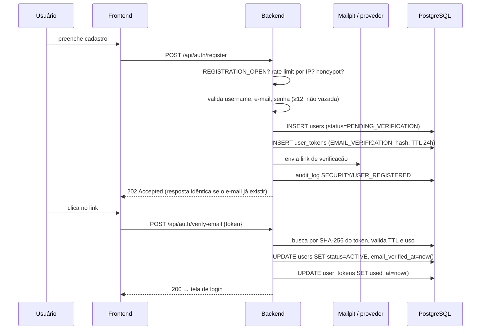

# Concord — Plano da Fase 2

**Documento 01 · Banco de dados e autenticação**
Status: aguardando aprovação · Pré-requisito: Fase 1 concluída

---

## 1. Escopo

**Entra:** schema inicial (`V1__init.sql`), entidades JPA, Spring Security com sessão em cookie, cadastro aberto com verificação de e-mail, login, logout, recuperação e alteração de senha, troca de e-mail, gestão de sessões, exclusão de conta, papel `ADMIN` com painel administrativo, `audit_log`, rate limiting, camada de e-mail com Mailpit, telas correspondentes no frontend.

**Não entra:** contatos, conversas, mensagens (Fase 3), WebSocket (Fase 4), qualquer coisa de WebRTC (Fase 5), exportação de dados em JSON (Fase 7 — a exclusão entra agora porque define o modelo de dados; a exportação não).

---

## 2. Modelo de dados — `V1__init.sql`

A migration cria quatro áreas: extensões, `users`, `user_tokens`, `audit_log` e o schema oficial do Spring Session. Chat e chamadas chegam em `V2` e `V3`.

```sql
-- =============================================================================
-- V1__init.sql — núcleo de identidade, tokens, auditoria e sessão
-- =============================================================================

CREATE EXTENSION IF NOT EXISTS citext;    -- comparação case-insensitive
CREATE EXTENSION IF NOT EXISTS pgcrypto;  -- gen_random_uuid()

-- ---------------------------------------------------------------- users -----
CREATE TABLE users (
    id                 UUID        PRIMARY KEY DEFAULT gen_random_uuid(),
    username           CITEXT      NOT NULL,
    email              CITEXT,               -- NULL após anonimização
    password_hash      TEXT        NOT NULL,
    display_name       TEXT        NOT NULL,
    avatar_url         TEXT,
    bio                TEXT,
    role               TEXT        NOT NULL DEFAULT 'USER',
    status             TEXT        NOT NULL DEFAULT 'PENDING_VERIFICATION',
    email_verified_at  TIMESTAMPTZ,
    failed_login_count INTEGER     NOT NULL DEFAULT 0,
    locked_until       TIMESTAMPTZ,
    last_login_at      TIMESTAMPTZ,
    disabled_at        TIMESTAMPTZ,
    disabled_reason    TEXT,
    anonymized_at      TIMESTAMPTZ,
    created_at         TIMESTAMPTZ NOT NULL DEFAULT now(),
    updated_at         TIMESTAMPTZ NOT NULL DEFAULT now(),

    CONSTRAINT users_role_chk
        CHECK (role IN ('USER', 'ADMIN')),
    CONSTRAINT users_status_chk
        CHECK (status IN ('PENDING_VERIFICATION', 'ACTIVE', 'DISABLED', 'DELETED')),
    CONSTRAINT users_username_chk
        CHECK (username ~ '^[A-Za-z0-9_]{3,20}$'),
    CONSTRAINT users_display_name_chk
        CHECK (char_length(display_name) BETWEEN 1 AND 50),
    CONSTRAINT users_bio_chk
        CHECK (bio IS NULL OR char_length(bio) <= 200),
    -- Conta excluída obrigatoriamente sem e-mail e com marca de anonimização.
    -- A invariante de LGPD vive no banco, não só no serviço.
    CONSTRAINT users_deleted_chk
        CHECK (status <> 'DELETED'
               OR (email IS NULL AND anonymized_at IS NOT NULL)),
    -- Conta ativa obrigatoriamente com e-mail verificado.
    CONSTRAINT users_active_chk
        CHECK (status <> 'ACTIVE' OR email_verified_at IS NOT NULL)
);

CREATE UNIQUE INDEX users_username_key ON users (username);
CREATE UNIQUE INDEX users_email_key    ON users (email) WHERE email IS NOT NULL;
CREATE INDEX users_status_idx          ON users (status);
CREATE INDEX users_created_at_idx      ON users (created_at DESC);
-- Suporta o job que expurga contas não verificadas.
CREATE INDEX users_pending_idx         ON users (created_at)
    WHERE status = 'PENDING_VERIFICATION';

-- ---------------------------------------------------------- user_tokens -----
-- Uma tabela para os três tokens de uso único enviados por e-mail. Separá-los
-- criaria três tabelas com colunas idênticas e três jobs de limpeza.
CREATE TABLE user_tokens (
    id          UUID        PRIMARY KEY DEFAULT gen_random_uuid(),
    user_id     UUID        NOT NULL REFERENCES users(id) ON DELETE CASCADE,
    type        TEXT        NOT NULL,
    -- Apenas o SHA-256 do token. Quem obtiver o banco não consegue usar um
    -- link de reset de senha.
    token_hash  TEXT        NOT NULL,
    -- Carga adicional: no EMAIL_CHANGE, guarda o novo endereço até a
    -- confirmação. Nunca guarda segredo.
    payload     TEXT,
    expires_at  TIMESTAMPTZ NOT NULL,
    used_at     TIMESTAMPTZ,
    created_at  TIMESTAMPTZ NOT NULL DEFAULT now(),

    CONSTRAINT user_tokens_type_chk
        CHECK (type IN ('EMAIL_VERIFICATION', 'PASSWORD_RESET', 'EMAIL_CHANGE'))
);

CREATE UNIQUE INDEX user_tokens_hash_key   ON user_tokens (token_hash);
CREATE INDEX user_tokens_user_type_idx     ON user_tokens (user_id, type);
CREATE INDEX user_tokens_expires_idx       ON user_tokens (expires_at);

-- ------------------------------------------------------------ audit_log -----
-- Tabela única para eventos de segurança, administrativos e de privacidade.
-- Categorias separadas em tabelas divergem; a coluna 'category' dá as mesmas
-- visões no painel e preserva a correlação temporal entre elas.
CREATE TABLE audit_log (
    id             BIGSERIAL   PRIMARY KEY,
    occurred_at    TIMESTAMPTZ NOT NULL DEFAULT now(),
    category       TEXT        NOT NULL,
    event_type     TEXT        NOT NULL,
    outcome        TEXT        NOT NULL,
    actor_user_id  UUID        REFERENCES users(id) ON DELETE SET NULL,
    -- Rótulo textual do ator no momento do evento. Sobrevive à anonimização
    -- da conta, permitindo auditar quem fez o quê sem manter dados pessoais
    -- vinculados por FK.
    actor_label    TEXT,
    target_user_id UUID        REFERENCES users(id) ON DELETE SET NULL,
    ip_address     INET,
    user_agent     TEXT,
    metadata       JSONB       NOT NULL DEFAULT '{}'::jsonb,

    CONSTRAINT audit_log_category_chk
        CHECK (category IN ('SECURITY', 'ADMIN', 'PRIVACY')),
    CONSTRAINT audit_log_outcome_chk
        CHECK (outcome IN ('SUCCESS', 'FAILURE', 'DENIED'))
);

CREATE INDEX audit_log_occurred_idx ON audit_log (occurred_at DESC);
CREATE INDEX audit_log_actor_idx    ON audit_log (actor_user_id, occurred_at DESC);
CREATE INDEX audit_log_target_idx   ON audit_log (target_user_id, occurred_at DESC);
CREATE INDEX audit_log_event_idx    ON audit_log (event_type, occurred_at DESC);
CREATE INDEX audit_log_category_idx ON audit_log (category, occurred_at DESC);

-- -------------------------------------------------------- spring session ----
-- Schema oficial do Spring Session JDBC para PostgreSQL, versionado aqui em
-- vez de criado em runtime (spring.session.jdbc.initialize-schema = never).
CREATE TABLE SPRING_SESSION (
    PRIMARY_ID            CHAR(36) NOT NULL,
    SESSION_ID            CHAR(36) NOT NULL,
    CREATION_TIME         BIGINT   NOT NULL,
    LAST_ACCESS_TIME      BIGINT   NOT NULL,
    MAX_INACTIVE_INTERVAL INTEGER  NOT NULL,
    EXPIRY_TIME           BIGINT   NOT NULL,
    PRINCIPAL_NAME        VARCHAR(100),
    CONSTRAINT SPRING_SESSION_PK PRIMARY KEY (PRIMARY_ID)
);

CREATE UNIQUE INDEX SPRING_SESSION_IX1 ON SPRING_SESSION (SESSION_ID);
CREATE INDEX SPRING_SESSION_IX2 ON SPRING_SESSION (EXPIRY_TIME);
-- Este índice é o que torna "encerrar todas as sessões de um usuário" barato.
CREATE INDEX SPRING_SESSION_IX3 ON SPRING_SESSION (PRINCIPAL_NAME);

CREATE TABLE SPRING_SESSION_ATTRIBUTES (
    SESSION_PRIMARY_ID CHAR(36)     NOT NULL,
    ATTRIBUTE_NAME     VARCHAR(200) NOT NULL,
    ATTRIBUTE_BYTES    BYTEA        NOT NULL,
    CONSTRAINT SPRING_SESSION_ATTRIBUTES_PK
        PRIMARY KEY (SESSION_PRIMARY_ID, ATTRIBUTE_NAME),
    CONSTRAINT SPRING_SESSION_ATTRIBUTES_FK
        FOREIGN KEY (SESSION_PRIMARY_ID) REFERENCES SPRING_SESSION(PRIMARY_ID)
        ON DELETE CASCADE
);
```

### Notas de modelagem

**`email` é anulável de propósito.** É o que permite anonimizar sem deletar a linha, mantendo íntegras as FKs que virão em `messages` e `audit_log`. O índice único parcial (`WHERE email IS NOT NULL`) permite várias contas excluídas convivendo.

**O username é liberado após a exclusão.** Ele é dado pessoal e por isso é anonimizado junto com o resto. Alguém poderia depois registrar o mesmo username — sem risco de personificação, porque mensagens referenciam `user_id`, não texto: o histórico continua exibindo "usuário removido", nunca o nome do novo titular.

**`actor_label` existe para resolver um conflito real.** A auditoria precisa dizer quem executou uma ação; a LGPD manda apagar o identificador quando a conta é excluída. A saída é guardar o rótulo do momento do evento e, na anonimização, substituí-lo por um pseudônimo estável. A FK vira NULL, o registro de segurança sobrevive.

---

## 3. Fluxos

### 3.1 Cadastro com verificação



**Enumeração de contas:** `/register` responde `202` mesmo quando o e-mail já está cadastrado; nesse caso envia ao endereço existente um aviso de "alguém tentou se cadastrar com seu e-mail". O username, esse sim, precisa responder de forma distinguível — é público por natureza, e a alternativa seria uma UX impraticável. O endpoint de disponibilidade de username tem rate limit próprio.

### 3.2 Login

Falha de senha incrementa `failed_login_count`. A partir de 5 falhas, `locked_until = now() + backoff` (1, 2, 4, 8, 15 minutos, teto de 15). Sucesso zera o contador, grava `last_login_at`, cria sessão e **regenera o id de sessão** (defesa contra session fixation). Conta em `PENDING_VERIFICATION`, `DISABLED` ou `DELETED` recebe a mesma resposta genérica de credencial inválida — com exceção de `PENDING_VERIFICATION`, que recebe uma mensagem específica com opção de reenviar a verificação, porque aqui a informação já é conhecida por quem cadastrou.

### 3.3 Exclusão de conta

Dois caminhos, mesmo procedimento técnico, auditoria diferente:

| | Titular | Admin |
|---|---|---|
| Gatilho | `DELETE /api/users/me` | `DELETE /api/admin/users/{id}` |
| Exige | Senha atual + confirmação digitada | Motivo obrigatório |
| Auditoria | `PRIVACY/ACCOUNT_DELETED_BY_OWNER` | `ADMIN/ACCOUNT_DELETED_BY_ADMIN` + motivo |
| Notificação | Confirmação por e-mail antes de apagar | E-mail ao titular após a ação |

**Procedimento (transacional):**

1. `status = 'DELETED'`, `anonymized_at = now()`
2. `username → 'removido_' || substr(md5(id::text), 1, 8)`
3. `email = NULL`, `display_name = 'Usuário removido'`, `avatar_url = NULL`, `bio = NULL`
4. `password_hash` recebe um valor aleatório inutilizável (nunca vazio — a coluna é `NOT NULL` e um hash em branco convidaria a bug de login)
5. `DELETE FROM user_tokens WHERE user_id = ?`
6. Todas as sessões destruídas via `PRINCIPAL_NAME`
7. `audit_log`: `actor_user_id`/`target_user_id` preservados, `actor_label` pseudonimizado
8. Job diário remove definitivamente as linhas de `audit_log` de categoria não obrigatória após 6 meses

**O que não é feito e por quê:** não há `DELETE FROM users`. Apagar a linha quebraria as FKs de `messages` na Fase 3 e destruiria o histórico legítimo do interlocutor. A decisão D-05 (anonimizar) está implementada aqui.

**Ponto para o advogado:** o Marco Civil pode obrigar a guarda de registros de acesso por 6 meses, o que compete com a eliminação imediata. O sistema mantém `audit_log` por 6 meses justamente para caber nessa hipótese; se a orientação jurídica for outra, muda-se o parâmetro do job, não o código.

---

## 4. Endpoints REST

Formato de erro em todas as respostas de falha, conforme §26 do briefing:

```json
{
  "code": "INVALID_CREDENTIALS",
  "message": "Usuário ou senha inválidos",
  "timestamp": "2026-08-18T14:03:11Z",
  "requestId": "01J8...",
  "fieldErrors": { "email": "Formato inválido" }
}
```

### Público

| Método | Rota | Corpo | Sucesso | Notas |
|---|---|---|---|---|
| POST | `/auth/register` | username, email, password, displayName, `website` (honeypot) | 202 | Rate limit 3/h por IP |
| POST | `/auth/verify-email` | token | 200 | Uso único, TTL 24 h |
| POST | `/auth/verify-email/resend` | email | 202 | 1 a cada 5 min |
| POST | `/auth/login` | usernameOrEmail, password | 200 + `Set-Cookie` | 401 genérico |
| POST | `/auth/password/forgot` | email | 202 | Sempre 202 |
| POST | `/auth/password/reset` | token, newPassword | 200 | Revoga todas as sessões |
| GET | `/auth/username-available` | `?username=` | 200 | 10/min |

### Autenticado

| Método | Rota | Sucesso | Notas |
|---|---|---|---|
| GET | `/auth/me` | 200 | Perfil + papel + estado |
| POST | `/auth/logout` | 204 | Invalida a sessão atual |
| PATCH | `/users/me` | 200 | displayName, bio |
| POST | `/users/me/password` | 204 | Exige senha atual; revoga as demais sessões |
| POST | `/users/me/email` | 202 | Envia confirmação ao novo endereço e aviso ao antigo |
| GET | `/users/me/sessions` | 200 | Dispositivo, IP, último acesso, qual é a atual |
| DELETE | `/users/me/sessions/{id}` | 204 | |
| DELETE | `/users/me/sessions` | 204 | Todas menos a atual |
| DELETE | `/users/me` | 204 | Exige senha; anonimiza |

### Administrativo — exige `ROLE_ADMIN`

| Método | Rota | Notas |
|---|---|---|
| GET | `/admin/users` | `?query=&status=&page=&size=`; busca por username, e-mail ou id |
| GET | `/admin/users/{id}` | Estado, datas, contagem de sessões. **Nenhum conteúdo privado** |
| POST | `/admin/users/{id}/disable` | Motivo obrigatório; encerra sessões; notifica |
| POST | `/admin/users/{id}/enable` | |
| POST | `/admin/users/{id}/sessions/revoke` | |
| DELETE | `/admin/users/{id}` | Motivo obrigatório; anonimiza |
| GET | `/admin/audit` | `?category=&eventType=&userId=&from=&to=&page=` |
| GET | `/admin/settings` · PATCH | Alterna `REGISTRATION_OPEN` em runtime |

Usuário comum em qualquer rota `/admin/**` recebe **404**, não 403 — 403 confirmaria a existência do painel.

---

## 5. Segurança da fase

| Controle | Parâmetro |
|---|---|
| Hash de senha | Argon2id, 19 MiB, 2 iterações, paralelismo 1, via `DelegatingPasswordEncoder` |
| Política de senha | ≥ 12 caracteres, checada contra lista local de senhas comuns |
| Sessão | Cookie opaco, `HttpOnly`, `SameSite=Lax`, `Secure` em produção, 7 dias de inatividade |
| Session fixation | Id regenerado no login (padrão do Spring Security, verificado por teste) |
| CSRF | `CookieCsrfTokenRepository`, header `X-XSRF-TOKEN` nos métodos mutáveis |
| Rate limit | Bucket4j em memória: login 5/min por IP + 10/h por conta; registro 3/h por IP; reset 3/h por IP; verificação 1/5 min |
| Tokens de e-mail | 256 bits de `SecureRandom`, armazenados como SHA-256, uso único |
| Headers | CSP, HSTS, `X-Content-Type-Options`, `Referrer-Policy`, `Permissions-Policy` |
| Timing | Login executa verificação de hash mesmo quando o usuário não existe, para não vazar existência pelo tempo de resposta |
| Auditoria | `LOGIN_SUCCESS`, `LOGIN_FAILURE`, `ACCOUNT_LOCKED`, `PASSWORD_CHANGED`, `PASSWORD_RESET`, `EMAIL_CHANGED`, `SESSION_REVOKED`, `USER_REGISTERED`, `EMAIL_VERIFIED`, `ACCOUNT_DISABLED`, `ACCOUNT_ENABLED`, `ACCOUNT_DELETED_*`, `ADMIN_ACCESS_DENIED`, `ADMIN_PROMOTED` |

---

## 6. Arquivos

**Criados — backend** (`backend/src/main/java/app/concord/`)

```
config/    SecurityConfig, SessionConfig, RateLimitConfig, CorsConfig,
           OpenApiConfig, SchedulingConfig
common/    exception/{ApiException,ErrorCode,GlobalExceptionHandler,ErrorResponse}
           dto/PageResponse
           audit/{AuditService,AuditEvent,AuditCategory,AuditLog,AuditLogRepository}
           ratelimit/{RateLimiter,RateLimitFilter,RateLimitKey}
           request/RequestIdFilter
user/      User, UserRole, UserStatus, UserRepository, UserService,
           UserController, UserMapper, dto/{UserResponse,UpdateProfileRequest,
           ChangePasswordRequest,ChangeEmailRequest,DeleteAccountRequest}
auth/      AuthController, AuthService, RegistrationService,
           EmailVerificationService, PasswordResetService,
           ConcordUserDetailsService, LoginAttemptService,
           SessionController, dto/{RegisterRequest,LoginRequest,...}
token/     UserToken, TokenType, UserTokenRepository, TokenService
email/     EmailService, EmailProvider, SmtpEmailProvider,
           EmailTemplate, templates/*.html
admin/     AdminUserController, AdminAuditController, AdminSettingsController,
           AdminService, AdminBootstrapRunner, dto/*
privacy/   AccountDeletionService
job/       ExpiredTokenCleanupJob, UnverifiedAccountCleanupJob, AuditRetentionJob
```

**Criados — frontend** (`frontend/src/`)

```
app/(auth)/         login, register, verify-email, forgot-password,
                    reset-password  (cada um com page.tsx)
app/(app)/          layout.tsx, settings/{profile,security,sessions,account}
app/(admin)/admin/  users/page.tsx, users/[id]/page.tsx, audit/page.tsx
features/auth/      LoginForm, RegisterForm, PasswordField, api.ts, useSession.ts
features/settings/  SessionList, ChangePasswordForm, DeleteAccountDialog
features/admin/     UserTable, UserDetail, AuditTable
components/ui/      shadcn/ui: button, input, label, card, dialog, table,
                    badge, alert, form
lib/                apiClient.ts (fetch + CSRF + tratamento de erro), csrf.ts
types/              api.ts
```

**Alterados:** `pom.xml` (mail, session-jdbc, bucket4j, argon2/bouncycastle, mapstruct), `application*.yml` (session, mail, app.*), `.env.example` (`CONCORD_BOOTSTRAP_ADMIN_EMAIL`), `docker-compose.yml` (variáveis de e-mail no backend), `frontend/package.json` (zustand, tanstack-query, zod, shadcn), `README.md`.

**Dependências novas — backend:** `spring-boot-starter-security`, `spring-boot-starter-mail`, `spring-boot-starter-thymeleaf` (templates de e-mail), `spring-session-jdbc`, `bucket4j-core`, `bcprov-jdk18on`, `mapstruct` + `mapstruct-processor`, `spring-security-test`.

**Frontend:** `zustand`, `@tanstack/react-query`, `zod`, `react-hook-form`, `@hookform/resolvers`, `tailwindcss-animate`, componentes shadcn/ui.

---

## 7. Testes da fase

| Camada | Casos |
|---|---|
| Unitário | Política de senha; backoff de bloqueio; geração e hash de token; máquina de estados da conta; regras de anonimização |
| Integração (Testcontainers) | Cadastro → verificação → login → logout; login com conta não verificada; reset de senha invalida sessões; troca de e-mail exige confirmação; exclusão anonimiza e mantém FKs |
| Segurança | `USER` recebe 404 em `/admin/**`; sessão de outro usuário não pode ser revogada; CSRF ausente é rejeitado; rate limit de login dispara; enumeração de e-mail não é possível; id de sessão muda no login |
| E-mail | Todos os fluxos verificados na caixa do Mailpit, via API HTTP dele nos testes |
| Frontend | Formulários com validação Zod; fluxo de login em Playwright; guarda de rota autenticada |

---

## 8. Comandos

```bash
docker compose up -d --build             # pom.xml e package.json mudaram
docker compose logs -f backend           # acompanhar a aplicação da V1
docker compose exec postgres psql -U concord -d concord -c '\dt'
docker compose exec backend mvn test
docker compose exec frontend npm run typecheck
```

Caixa de entrada de desenvolvimento: <http://localhost:8025>

Para promover o primeiro admin: preencher `CONCORD_BOOTSTRAP_ADMIN_EMAIL` no `.env`, cadastrar e verificar essa conta, reiniciar o backend.

---

## 9. Critérios de conclusão

1. Cadastro exige verificação de e-mail; conta não verificada não loga e não aparece em busca.
2. E-mails de verificação, reset e troca chegam ao Mailpit — **nenhum e-mail sai para a internet**.
3. Senha armazenada em Argon2id; nenhuma senha aparece em log.
4. Cookie de sessão com `HttpOnly`, `SameSite=Lax`, e o id muda após o login.
5. Reset e alteração de senha revogam as demais sessões.
6. Tela de sessões lista e encerra dispositivos.
7. Rate limit dispara em login, registro e reset, comprovado por teste.
8. `USER` recebe 404 em todo `/admin/**`; tentativa registrada em `audit_log`.
9. Admin lista, pesquisa, desativa, reativa, exclui e revoga sessões — e não tem endpoint algum que retorne conteúdo privado.
10. Toda ação administrativa e todo evento de segurança gera `audit_log` com ator, alvo, IP, resultado e timestamp.
11. Exclusão anonimiza sem apagar a linha; um `SELECT` no banco confirma ausência de e-mail e de nome.
12. O sistema recusa desativar ou excluir o último admin.
13. Jobs de expurgo (tokens expirados, contas não verificadas há 7 dias) executam e são testados.
14. `mvn test` e `npm run typecheck` passam.

---

## 10. Riscos e pontos de atenção

| Risco | Mitigação |
|---|---|
| Argon2id com 19 MiB pode pesar em VPS pequena sob rajada de logins | Rate limit de login é a defesa primária; parâmetros ficam em configuração para ajuste |
| Rate limit em memória se perde no restart | Aceito nesta escala; migrar para tabela ou Redis só se houver abuso real |
| Frontend precisa de CSRF em toda mutação | Centralizado no `apiClient`; nenhum `fetch` solto nos componentes |
| Bootstrap do admin pode ser mal usado se a variável ficar preenchida | Só age quando não há nenhum admin; auditado; documentar que a variável deve ser esvaziada depois |
| shadcn/ui entra agora e define o visual do produto | É a hora certa: refazer estilo depois de 20 telas custa mais |

---

## 11. Pendências que esta fase não resolve

- Webhook de bounce e status de entrega (Fase 7, junto com o provedor real).
- Exportação de dados do titular em JSON (Fase 7).
- Escolha do fornecedor de e-mail de produção e configuração de SPF/DKIM/DMARC (antes da Fase 9).
- Política de privacidade e termos de uso — texto jurídico, não código.
