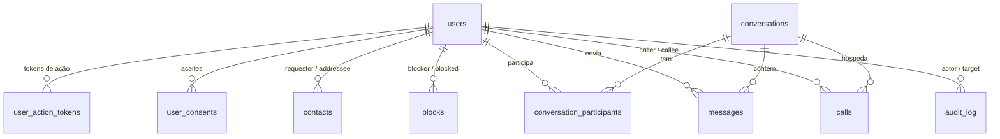

# Concord — Banco de dados

PostgreSQL 16, migrado por Flyway. O Hibernate roda com `ddl-auto: validate`:
o schema pertence às migrations, e o mapeamento apenas confere se bate.

---

## Migrations

| Arquivo | Fase | Conteúdo |
|---|---|---|
| `V1__init.sql` | 2 | `users`, `user_action_tokens`, `audit_log`, `app_settings`, `SPRING_SESSION*` |
| `V2__chat.sql` | 3 | `contacts`, `blocks`, `conversations`, `conversation_participants`, `messages` |
| `V3__calls.sql` | 5 | `calls` |
| `V4__privacy.sql` | 7 | `user_consents`, `email_suppressions` |

**Sem extensões.** `gen_random_uuid()` é nativo no PostgreSQL 13+, e a comparação case-insensitive usa índice funcional em `lower()` em vez de `citext` — que exigiria `stringtype=unspecified` no driver JDBC para funcionar de forma confiável com o Hibernate.

---

## Diagrama



---

## Invariantes impostas pelo banco

Não são validações do serviço. São `CHECK` constraints: um bug futuro faz a transação falhar em vez de deixar dado inconsistente.

```sql
-- Conta excluída não conserva e-mail nem fica sem marca de anonimização
CHECK (status <> 'DELETED' OR (email IS NULL AND anonymized_at IS NOT NULL))

-- Conta só fica ativa depois da verificação de e-mail
CHECK (status <> 'ACTIVE' OR email_verified_at IS NOT NULL)

-- Mensagem apagada não conserva o texto
CHECK (deleted_at IS NULL OR body IS NULL)

-- Chamada encerrada tem instante e motivo
CHECK (status <> 'ENDED' OR (ended_at IS NOT NULL AND end_reason IS NOT NULL))
```

---

## Chaves canônicas

Três casos em que a unicidade de um **par** precisa ser garantida contra corrida. Verificação em Java não resolve: dois pedidos simultâneos passam os dois pela checagem antes de qualquer um gravar.

| Coluna | Tabela | Impede |
|---|---|---|
| `pair_key` | `contacts` | A→B e B→A como dois pedidos abertos |
| `direct_key` | `conversations` | Duas conversas para a mesma dupla |
| `(conversation_id, client_message_id)` | `messages` | Mensagem duplicada em retry de rede |

Todas no formato `menor_uuid:maior_uuid`, calculadas na aplicação e garantidas por índice único.

---

## Comportamento de exclusão

| FK | Ação | Por quê |
|---|---|---|
| `messages.sender_id` → `users` | `RESTRICT` | Se algum código futuro tentar `DELETE` real em `users`, o banco recusa em vez de destruir o histórico do interlocutor |
| `calls.caller_id` / `callee_id` | `RESTRICT` | Idem |
| `audit_log.actor_user_id` | `SET NULL` | O evento sobrevive ao titular |
| `conversation_participants` | `CASCADE` | Participação não faz sentido sem a conversa |
| `user_action_tokens.user_id` | `CASCADE` | Token não sobrevive à conta |

**Nenhuma conta é removida.** A exclusão anonimiza (D-05). Os `RESTRICT` existem como rede de proteção contra código futuro que esqueça disso.

---

## Retenção

| Dado | Prazo | Executado por |
|---|---|---|
| Tokens usados/expirados | Diário | `CleanupJobs.purgeExpiredTokens` |
| Contas não verificadas | 7 dias | `CleanupJobs.purgeUnverifiedAccounts` |
| IP no `audit_log` | 6 meses | `CleanupJobs.applyAuditRetention` |
| `audit_log` SECURITY | 6 meses | idem |
| `audit_log` ADMIN | 24 meses | idem |
| `audit_log` PRIVACY | 60 meses | idem (nasce sem IP) |
| IP em `user_consents` | 6 meses | `CleanupJobs.applyPrivacyRetention` |
| Soft bounces | 30 dias | idem |
| `calls` | 180 dias | `CallReaper.purgeOldHistory` |
| Sessões expiradas | 7 dias | Spring Session |

---

## Índices que sustentam operações críticas

| Índice | O que torna barato |
|---|---|
| `SPRING_SESSION_IX3 (PRINCIPAL_NAME)` | Revogar todas as sessões de um usuário |
| `messages_conversation_idx (conversation_id, created_at DESC, id DESC)` | Paginação por keyset |
| `calls_open_idx WHERE status IN ('RINGING','ACTIVE')` | "Esta pessoa já está em chamada?" |
| `users_pending_idx WHERE status = 'PENDING_VERIFICATION'` | Expurgo de contas não confirmadas |
| `users_email_lower_key WHERE email IS NOT NULL` | Unicidade permitindo várias contas excluídas |

---

## Operação

```bash
# Console
docker compose exec postgres psql -U concord -d concord

# Estado das migrations
docker compose exec backend mvn flyway:info

# Backup
docker compose exec postgres pg_dump -U concord -Fc concord > concord-$(date +%F).dump

# Restauração
docker compose exec -T postgres pg_restore -U concord -d concord --clean < arquivo.dump
```

O backup contém **mensagens em texto claro** — trate o arquivo como o dado mais sensível do sistema. Ver §9.1 do `SECURITY.md`.
