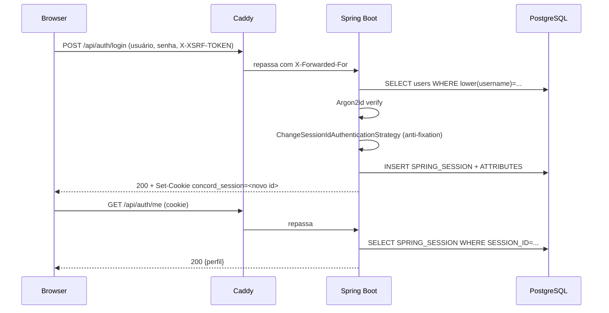

# Concord — Sessão e Autenticação

**Documento 02** · Escrito antes da implementação da Fase 2, conforme solicitado.
Este documento é normativo: o código da Fase 2 segue exatamente o que está aqui.

---

## 1. Cadeia da sessão

```
Browser
   │  cookie concord_session (opaco, 36 chars, sem significado)
   ▼
HTTPS ────────────────────────────────  (em dev: http://localhost, contexto seguro)
   │
   ▼
Cookie: HttpOnly · Secure · SameSite=Lax · Path=/ · sem Domain
   │
   ▼
Spring Session  ─── SessionRepositoryFilter resolve o id em Session
   │
   ▼
Spring Security ─── lê SPRING_SECURITY_CONTEXT dos atributos da sessão
   │
   ▼
Session store: PostgreSQL
   SPRING_SESSION             (id, criação, último acesso, expiração, principal)
   SPRING_SESSION_ATTRIBUTES  (contexto de segurança + metadados do dispositivo)
```

O cookie não carrega identidade: ele é um ponteiro. Toda a informação vive no banco. É isso que torna a revogação instantânea — apagar a linha encerra a sessão no próximo request, sem esperar expiração de token.



---

## 2. Parâmetros do cookie

| Atributo | Desenvolvimento | Produção | Motivo |
|---|---|---|---|
| Nome | `concord_session` | `concord_session` | Nome próprio evita colisão com outro app em `localhost` |
| `HttpOnly` | `true` | `true` | JavaScript não lê o cookie. É a defesa central contra roubo de sessão por XSS |
| `Secure` | `false` | `true` | Em dev não há TLS. `http://localhost` é contexto seguro por decisão dos navegadores, então `getUserMedia` funciona mesmo assim |
| `SameSite` | `Lax` | `Lax` | Bloqueia o envio do cookie em requisições cross-site do tipo POST, o que já elimina a maior parte do CSRF. `Strict` quebraria o clique em links de e-mail; `None` seria desnecessariamente permissivo, já que frontend e backend compartilham origem |
| `Path` | `/` | `/` | O cookie precisa valer para `/` (frontend) e `/api` (backend) |
| `Domain` | não definido | não definido | Sem `Domain`, o cookie é host-only e não vaza para subdomínios |

Frontend e backend estão **na mesma origem** por meio do Caddy — em dev e em produção. Essa é a decisão que sustenta todo o resto: sem cross-site, `SameSite=Lax` basta, não há preflight CORS com credenciais e o comportamento é idêntico nos dois ambientes.

---

## 3. Ciclo de vida

### Expiração

- **Inatividade: 7 dias.** Cada requisição autenticada atualiza `LAST_ACCESS_TIME`; `EXPIRY_TIME` é recalculado.
- **Teto absoluto: 30 dias.** Independente de atividade, a sessão morre. Implementado como um atributo `createdAt` verificado a cada request — o Spring Session sozinho só oferece expiração por inatividade.
- Sessões expiradas são removidas do banco por tarefa de limpeza do próprio Spring Session, com um job diário de reforço.

### Renovação

Não existe endpoint de renovação, e é intencional. Sessão opaca renova-se sozinha pelo uso; um endpoint de refresh seria complexidade herdada do modelo de JWT sem nenhuma função aqui.

### Logout

`POST /api/auth/logout` → invalida a sessão (`session.invalidate()`), limpa o `SecurityContext`, apaga a linha de `SPRING_SESSION` e expira o cookie no navegador. Auditado como `SESSION_LOGOUT`.

### Revogação

| Cenário | Efeito |
|---|---|
| Usuário encerra uma sessão específica | Apaga aquela linha. As demais continuam |
| Usuário encerra todas as outras | Apaga tudo menos a atual |
| Troca de senha | Apaga todas menos a atual (quem trocou continua logado) |
| Reset de senha por e-mail | Apaga **todas**, inclusive a atual. Quem pediu o reset perdeu o controle da senha; presume-se comprometimento |
| Admin desativa a conta | Apaga todas |
| Conta excluída | Apaga todas |

Todas as revogações se apoiam no índice `SPRING_SESSION_IX3 (PRINCIPAL_NAME)`, via `FindByIndexNameSessionRepository.findByPrincipalName(username)`. É por isso que o username é imutável no Concord: ele é a chave de indexação das sessões.

### Múltiplos dispositivos

Permitido e sem limite prático. Cada login cria uma sessão independente. No momento do login são gravados como atributos da sessão: instante de criação, IP e user-agent — usados apenas para renderizar a lista "Sessões ativas" e permitir que o titular reconheça um acesso que não é dele.

Esses atributos ficam em `SPRING_SESSION_ATTRIBUTES` e morrem com a sessão. Não vão para o `audit_log`, que é retido por muito mais tempo.

---

## 4. Session fixation

Login manual (JSON, não `formLogin`) não recebe proteção automática. O `AuthService` chama explicitamente `ChangeSessionIdAuthenticationStrategy.onAuthentication(...)` **antes** de gravar o `SecurityContext`, o que troca o id da sessão mantendo os atributos.

Consequência prática: um id de sessão obtido antes do login (por exemplo, fixado por um atacante via link) deixa de valer no instante em que a autenticação ocorre. Há teste de integração dedicado comparando o valor de `Set-Cookie` antes e depois.

---

## 5. CSRF

Sessão em cookie exige proteção CSRF — é o preço do modelo, e ele é pequeno.

- Repositório: `CookieCsrfTokenRepository.withHttpOnlyFalse()` → cookie `XSRF-TOKEN`, legível por JavaScript **de propósito** (não é segredo de sessão; é o outro lado do double submit).
- O cliente envia o valor no header `X-XSRF-TOKEN` em todo `POST`, `PUT`, `PATCH` e `DELETE`. Centralizado no `apiClient`; nenhum `fetch` solto nos componentes.
- `GET`, `HEAD` e `OPTIONS` são isentos, por serem métodos seguros.
- Um filtro força a materialização do token a cada requisição, garantindo que o cookie exista antes do primeiro POST.
- Ausência ou divergência do token → `403` com código `CSRF_TOKEN_INVALID`.

`SameSite=Lax` e o token CSRF são camadas independentes. A primeira falha se o navegador for antigo ou se algum dia houver um subdomínio hostil; a segunda cobre esse caso.

---

## 6. Autenticação no WebSocket (preparado agora, usado na Fase 4)

Esta é a razão mais forte para a sessão em cookie, e o ponto que você pediu para garantir: **REST e WebSocket reconhecem exatamente a mesma identidade, sem nenhum mecanismo adicional.**

```
Browser abre wss://host/api/ws
   │  o navegador anexa automaticamente o cookie concord_session
   ▼
Handshake HTTP GET /api/ws com Upgrade: websocket
   │
   ▼
SessionRepositoryFilter resolve a sessão (é uma requisição HTTP comum)
   │
   ▼
Spring Security popula o SecurityContext
   │
   ▼
HandshakeInterceptor: sem Authentication → recusa com 401, conexão não abre
   │
   ▼
Principal fica associado à sessão WebSocket
   │
   ▼
@MessageMapping recebe Principal em todo handler
```

Três consequências que orientam a Fase 4:

1. **Nenhum token na query string.** Passar credencial em `?token=` a expõe em logs de proxy, histórico e Referer. O cookie resolve sem isso.
2. **`senderId` nunca vem do payload.** A identidade é o `Principal` da sessão STOMP. Campos de remetente enviados pelo cliente são ignorados.
3. **Revogar a sessão derruba o WebSocket.** Quando um admin desativa uma conta ou o usuário encerra a sessão, a conexão em tempo real é encerrada junto — um `SessionRepository` sem a linha significa handshake recusado, e as conexões vivas são fechadas ativamente pelo `PresenceService`.

O handshake **é** uma requisição HTTP, então tudo que vale para o REST vale aqui: mesmo cookie, mesmo store, mesma revogação, mesma expiração.

---

## 7. Comportamento por ambiente

| | Desenvolvimento | Produção |
|---|---|---|
| Origem | `http://localhost` (Caddy na porta 80) | `https://dominio` (Caddy com TLS automático) |
| `Secure` no cookie | `false` | `true` |
| HSTS | desligado | ligado, com `includeSubDomains` |
| Contexto seguro para WebRTC | sim (`localhost` é exceção da especificação) | sim (TLS) |
| Store de sessão | PostgreSQL do compose | PostgreSQL do compose |
| E-mail | Mailpit, nada sai para a internet | provedor transacional |
| Detalhe do health check | completo | apenas o status agregado |

A variável que controla isso é `SESSION_COOKIE_SECURE`. Nenhum outro comportamento de autenticação difere entre ambientes — o objetivo é que um bug de sessão apareça na máquina do desenvolvedor, não em produção.

---

## 8. Por que não JWT (resumo do ADR-02)

| Requisito seu | Sessão | JWT |
|---|---|---|
| Revogação de sessão | `DELETE` numa linha | Exige blacklist — que é um session store com outro nome |
| Listar dispositivos ativos | Consulta por `PRINCIPAL_NAME` | Exige registro paralelo dos tokens emitidos |
| Autenticar o WebSocket | Automático no handshake | Token na query string ou no frame CONNECT |
| Resistência a XSS | Cookie `HttpOnly` | `localStorage` é legível por qualquer script |
| Custo | Um `SELECT` por request | Complexidade de refresh e rotação |

O único ganho real do JWT — não consultar o store — resolve um problema de escala horizontal que o Concord não tem, e cobra por isso justamente nos pontos que você listou como requisito.
