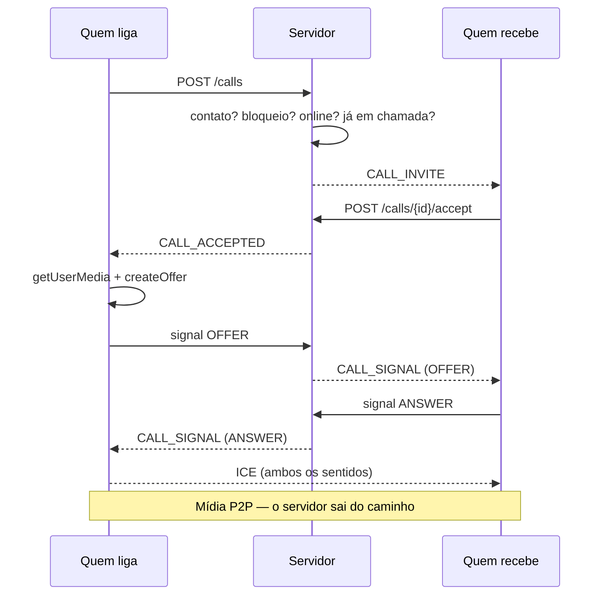

# Concord — WebRTC

Chamadas de voz, vídeo e tela. **P2P puro para 1:1** (decisão D-06).

---

## 1. O servidor não vê mídia

Áudio e vídeo vão direto entre os navegadores. Quando o NAT não permite caminho direto, passam pelo TURN — que só encaminha bytes já cifrados por DTLS-SRTP e não consegue lê-los.

O servidor faz três coisas: arbitra quem pode ligar para quem, repassa envelopes de sinalização sem interpretá-los, e emite credenciais de TURN.

**O que nunca é gravado:**

| Dado | Por quê |
|---|---|
| SDP | Descreve codecs, IPs internos, portas e capacidades do dispositivo — impressão digital de máquina |
| Candidatos ICE | Revelam IP local, IP público e topologia de rede |
| Mídia | Não chega ao servidor |

O que fica em `calls` é o registro que o próprio usuário vê no histórico: quem, quando, tipo, duração. Retenção de 180 dias.

---

## 2. Divisão dos caminhos

| Operação | Transporte | Por quê |
|---|---|---|
| Convidar, aceitar, recusar, desligar | REST | Muda estado persistido |
| SDP, candidatos ICE, aviso de tela | STOMP | Efêmero, dezenas de mensagens nos primeiros segundos |

---

## 3. Negociação



**Quem liga é sempre quem oferta.** Fixado no servidor, elimina *glare* — a colisão em que os dois lados ofertam ao mesmo tempo e a conexão nunca se estabelece. É por isso que não foi preciso implementar *perfect negotiation*.

---

## 4. Máquina de estados

```
RINGING ──accept──> ACTIVE ──hangup──> ENDED
   │                   │
   ├─reject──> ENDED   └─queda───────> ENDED (FAILED)
   ├─cancel──> ENDED
   └─45s─────> ENDED (MISSED)
```

Três caminhos encerram uma chamada, porque nem toda chamada termina com alguém clicando em desligar:

1. **Clique** — `HANGUP` ou `CANCELLED`
2. **Queda do WebSocket** — o `PresenceService` encerra na hora; sem isso, o outro lado veria "em chamada" com alguém que já foi embora
3. **`CallReaper`** a cada 15 s — `MISSED` após 45 s tocando, `FAILED` após 6 h ativa

**Uma chamada aberta por pessoa.** Sem essa regra, um cliente com defeito poderia disparar convites em série e fazer o telefone de alguém tocar indefinidamente.

---

## 5. Credenciais de TURN

```
username = <expiração unix>:<id do usuário>
password = base64(HMAC-SHA1(segredo, username))
```

Mecanismo `use-auth-secret` do coturn: valida a assinatura sem consultar banco de usuários. Validade de 1 hora.

**O segredo nunca chega ao navegador.** Credencial estática embutida no frontend — o caminho comum em tutoriais — transformaria o servidor em relay aberto assim que alguém abrisse o DevTools.

O id do usuário entra no username por rastreabilidade: se um relay for abusado, o log do coturn diz de quem era a credencial.

`GET /api/webrtc/ice` exige autenticação, pelo mesmo motivo.

---

## 6. Endurecimento do coturn

```conf
denied-peer-ip=10.0.0.0-10.255.255.255      # e todas as faixas privadas
max-bps=750000                               # 6 Mbit/s por sessão
bps-capacity=100000000                       # teto agregado
```

Sem `denied-peer-ip`, o TURN alcançaria a rede interna do servidor — inclusive o PostgreSQL e o Mailpit. É a configuração mais importante do arquivo.

---

## 7. Compartilhamento de tela

`replaceTrack` no transceiver que já existe: mesmo codec, mesmo SSRC, mesmo transporte. **Não há renegociação**, e por isso a troca é instantânea.

A exceção é a chamada que começou só com voz: não há trilha de vídeo para substituir, então a trilha é acrescentada e a negociação acontece.

**Áudio do sistema não é capturado.** Transmitir a saída de som da máquina inteira é a forma mais fácil de vazar sem querer uma notificação ou outra conversa.

`contentHint = "detail"` e 15 fps: tela costuma ser texto, e a escolha é por nitidez em vez de fluidez.

A barra "Parar de compartilhar" do navegador não pode ser suprimida — o evento `ended` da trilha é tratado para que a interface acompanhe.

No desktop, `getDisplayMedia` não funciona sem `setDisplayMediaRequestHandler`. Ver `DESKTOP.md` §4.

---

## 8. Trade-off registrado

`iceTransportPolicy: "all"` — permite caminho direto quando possível e cai no relay só se precisar.

Forçar `"relay"` esconderia o IP dos participantes um do outro, ao custo de passar **toda** a mídia pelo servidor. É uma linha de código se você quiser inverter; a escolha atual privilegia banda e latência.

---

## 9. Limites

**Grupos não são suportados.** Em malha P2P com 4 pessoas, cada uma envia 3 fluxos e recebe 3 — o upload do participante vira o gargalo por volta de 4 a 5 pessoas. Passar disso exige SFU, que traz a mídia toda para o servidor e muda a conta de capacidade por uma ordem de grandeza.

**Sem gravação de chamada**, por decisão. Implementá-la significaria o servidor processar mídia, o que a arquitetura evita deliberadamente.
